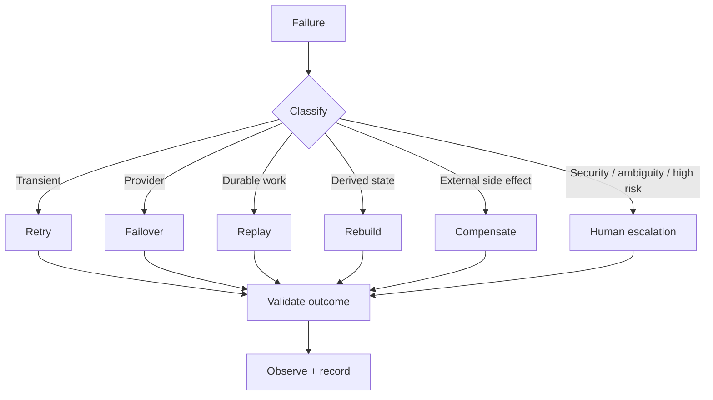

# CAT OMNISYSTEM — Failure Modes & Recovery Matrix

**Status:** Canonical target operating model

## 1. Principle

CAT is designed around failure as a normal operating condition. The objective is not to eliminate every failure but to make failures bounded, observable, recoverable and non-destructive to durable truth.

## 2. Failure matrix

| Failure | Detection | Default response | Evidence | Escalation |
|---|---|---|---|---|
| worker crash | lease/heartbeat expiry | reclaim durable work | attempt/lease record | repeated crashes |
| provider timeout | timeout | bounded retry/backoff | provider attempt | retry exhaustion |
| provider 5xx | response classification | retry/failover | attempt + provider health | systemic outage |
| provider schema drift | validation failure | quarantine adapter result | raw/reference + validation error | connector owner |
| duplicate callback | idempotency key | return existing result | dedup record | anomaly if conflicting |
| database outage | connection errors/health | preserve command, retry later | operational metrics | operator |
| event consumer crash | delivery retry | redeliver | delivery attempt | dead-letter threshold |
| projection corruption | invariant/checksum mismatch | rebuild projection | rebuild record | operator |
| clock regression | clock abstraction | fail closed for time-sensitive action | domain error | operator |
| authorization failure | policy engine | deny | audit record | human if unexpected |
| budget exhaustion | budget guard | stop or degrade | budget event | operator |
| model invalid output | schema validator | reject / retry / alternate model | evaluation artifact | supervisor |
| unsafe tool request | capability/policy gate | deny | security audit | security owner |
| data-quality anomaly | validation/evaluation | quarantine | quality event | domain owner |

## 3. Recovery classes

### R0 — local retry
Safe for transient, idempotent operations.

### R1 — provider failover
Switch to an independently configured provider when the capability contract permits it.

### R2 — durable replay
Reprocess accepted commands/events from durable state.

### R3 — projection rebuild
Reconstruct derived state from authoritative facts.

### R4 — compensation
Create an explicit compensating action/fact when an external effect cannot be rolled back.

### R5 — human intervention
Pause autonomous behavior and require an operator decision.

## 4. Recovery flow

## 5. Retry rules

Retries must be policy-driven. They require:

- bounded attempts;
- backoff/jitter where appropriate;
- idempotency strategy;
- deadline awareness;
- provider health consideration;
- clear classification of permanent errors.

Never retry a policy denial as if it were a network failure.

## 6. Dead-letter principle

Dead-lettered work is not deleted work. It remains inspectable and replayable under explicit operator or policy authority.

## 7. Compensation

When CAT publishes content, submits an advertising action or triggers another irreversible external effect, rollback may be impossible. The system must therefore record the original effect and use compensating operations where the provider supports them.

## 8. Incident lifecycle

`Detect -> classify -> contain -> preserve evidence -> recover -> validate -> learn -> prevent recurrence`

Post-incident changes should update tests, contracts, alerts or policies rather than relying only on operator memory.

## 9. Fail-closed boundaries

CAT should fail closed when uncertainty affects:

- authorization;
- financial settlement;
- credential exposure;
- tenant isolation;
- destructive operations;
- policy interpretation.

For lower-risk informational features, graceful degradation may be preferable.

## 10. Recovery definition of done

A feature is not complete until its top failure modes have deterministic detection, recovery policy, evidence requirements, tests and operator visibility.
