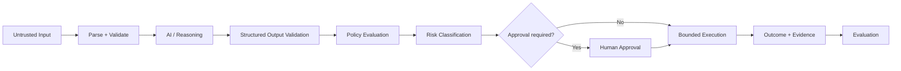

# CAT OMNISYSTEM — AI Safety & Human Oversight

**Status:** Canonical target architecture

## 1. Scope

CAT uses AI as a reasoning, generation, classification and automation substrate. AI output is therefore treated as a capability, not an authority. Authority comes from contracts, policies, identity, approvals and durable system state.

## 2. Trust pipeline

## 3. Core safety invariants

1. Model output cannot directly grant itself new authority.
2. Prompts cannot override system policy.
3. Tool access is capability-scoped.
4. External content is untrusted input, including instructions embedded in content.
5. High-impact actions require stronger validation and, where configured, human approval.
6. Security and economic controls are enforced outside the model's natural-language reasoning.
7. Model/provider changes must not silently change domain contracts.

## 4. Prompt injection boundary

External text may contain adversarial instructions. CAT should treat retrieved documents, webpages, product descriptions, messages and provider responses as data unless an explicit contract promotes a field to executable instruction.

The model should never receive unrestricted authority merely because an external source says it should.

## 5. Risk levels

| Level | Example | Default control |
|---|---|---|
| Low | summarization, classification | automated |
| Medium | content publication draft, opportunity ranking | validation + monitoring |
| High | paid campaign change, financial allocation | policy + approval/strong gate |
| Critical | credential rotation, destructive data operation | explicit owner authority |

Actual classification belongs to domain policy.

## 6. Model uncertainty

Confidence scores are evidence, not permission. A highly confident model may still be wrong. High-impact actions should depend on independent validation, source evidence or human review rather than model confidence alone.

## 7. Model evaluation

Evaluation should measure at least:

- correctness;
- schema adherence;
- policy adherence;
- hallucination/error rate where measurable;
- reproducibility/determinism where required;
- cost;
- latency;
- downstream economic or operational outcome.

## 8. Human oversight modes

Human oversight may be:

- pre-action approval;
- sampled review;
- exception review;
- post-action audit;
- emergency stop authority.

The control plane should make these modes visible instead of presenting all automation as equally autonomous.

## 9. Emergency stop

CAT should support disabling an agent, capability, provider, workflow class or economic action without deleting evidence. Stop mechanisms should be designed as control-plane operations with strong authorization.

## 10. Safety telemetry

Safety-relevant telemetry includes denied actions, policy conflicts, unusual tool sequences, repeated validation failures, provider anomalies, budget breaches and human overrides. Sensitive payloads should be minimized in telemetry.

## 11. AI change management

A model upgrade is an implementation change even when APIs remain compatible. Significant model changes require evaluation against representative contracts and safety cases before promotion.

## 12. Definition of done

An AI feature is production-ready only when its input trust level, output validation, capability boundary, policy authority, risk class, human-oversight mode, evaluation plan and emergency controls are documented.
