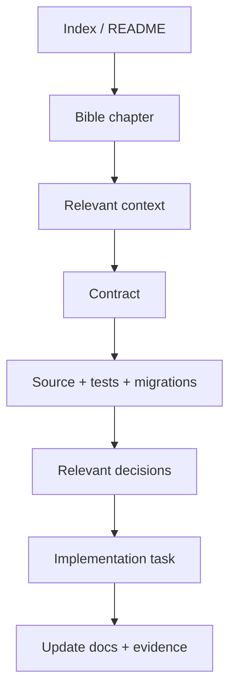

# CAT OMNISYSTEM — Documentation & Knowledge Governance

**Status:** Canonical documentation policy

## 1. Documentation is part of the system

For an AI-native project, documentation is not only for humans. It is an operational knowledge layer consumed by coding agents, research agents, reviewers and future maintainers. Incorrect documentation can therefore cause real implementation defects.

## 2. Source hierarchy

The hierarchy defined by the Bible remains authoritative:

1. executable code, tests and migrations;
2. explicit implementation contracts;
3. engineering standards;
4. ADRs;
5. CAT Bible;
6. research/proposals.

When a lower-level source conflicts with a higher-authority implementation artifact, the conflict must be documented and resolved rather than silently choosing the preferred narrative.

## 3. Document classes

| Class | Purpose | Update trigger |
|---|---|---|
| Bible | system meaning and target architecture | domain/architecture evolution |
| Contract | enforceable behavior | interface/invariant change |
| ADR | decision rationale | architectural decision |
| Runbook | operational procedure | operational change |
| Research | evidence and proposals | new research |
| Reference | stable lookup material | terminology/schema/tool change |
| Status | point-in-time project state | milestone/review |

## 4. Maturity labels

Every target-facing document should make maturity explicit. Recommended labels:

`VISION`, `RESEARCH`, `TARGET`, `SPECIFIED`, `IMPLEMENTED`, `TESTED`, `INTEGRATED`, `OBSERVED`, `DEPRECATED`.

A document must not imply `IMPLEMENTED` solely because a path or placeholder exists.

## 5. AI reading protocol

Agents should retrieve the smallest complete context needed for a task rather than blindly loading the entire repository into a prompt.

## 6. Canonical terminology

Names must be stable across code, docs and UI. If a term changes, update the terminology source and provide a compatibility alias where needed. Avoid creating synonyms for the same architectural concept.

## 7. Diagrams

Architecture diagrams should have a text-equivalent whenever practical. Mermaid is preferred for editable semantic diagrams; SVG may be used for polished documentation visuals. Diagrams must not claim components that are absent from executable reality without a maturity label.

## 8. Documentation review gates

Before merging a major architecture change, reviewers should ask:

- What source is authoritative?
- Which contracts changed?
- Which diagrams became stale?
- Which AI bootstrap/context files must change?
- Does the terminology remain consistent?
- Are implementation and target architecture clearly separated?
- Can a new AI agent discover the new rule without reading historical chat?

## 9. Knowledge lifecycle

`Capture -> normalize -> classify -> link -> validate -> publish -> consume -> supersede`.

Historical documents should normally be preserved when they explain why a decision changed. Current canonical documents should clearly identify the current state.

## 10. Anti-patterns

- duplicate “master” documents with different truths;
- status files used as permanent architecture specifications;
- huge documents with no index or section IDs;
- undocumented generated content presented as canonical;
- diagrams disconnected from contracts;
- silent edits that change historical meaning.

## 11. AI-facing quality rule

Every major subsystem should eventually expose four views: conceptual, architectural, behavioral and contractual. If one view is missing, the subsystem is harder for an AI agent to implement safely.

## 12. Documentation definition of done

A document is complete when it has a clear owner, purpose, maturity, dependencies, stable terminology, machine-readable structure where useful, and explicit links to the implementation or contract evidence that makes its claims verifiable.
