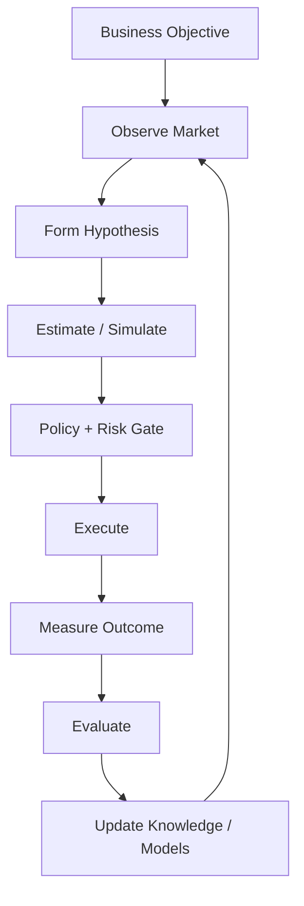

# 12 — Autonomy, Learning & Evaluation

**Status:** Long-term operating model.

## 1. Autonomy is controlled optimization

CAT is not defined by the ability to execute commands without humans. It is defined by its ability to make useful decisions under constraints, observe outcomes, learn from evidence, and remain safe when uncertain.

## 2. Autonomy levels

| Level | Behavior |
|---|---|
| A0 | Human performs action |
| A1 | CAT recommends |
| A2 | CAT prepares action; human approves |
| A3 | CAT executes low-risk actions automatically |
| A4 | CAT manages bounded workflows autonomously |
| A5 | CAT continuously optimizes within explicit governance limits |

An agent must never infer a higher autonomy level from model confidence alone.

## 3. Closed loop

## 4. Evaluation dimensions

CAT should evaluate both the agent and the business result:

- factual accuracy;
- task success;
- policy compliance;
- tool correctness;
- latency;
- token/model cost;
- failure/retry rate;
- human override rate;
- conversion contribution;
- commission contribution;
- incremental profit;
- regret/opportunity cost.

## 5. Experiment governance

Learning systems require protected evaluation sets, versioned models/prompts/policies, reproducible inputs, and rollback. A model improvement is not accepted merely because one metric increased; side effects and confidence must also be evaluated.

## 6. Simulation

Before expensive or irreversible actions, CAT may simulate alternatives using historical data, synthetic scenarios, or forecasting models. Simulation is advisory unless explicitly connected to a policy gate.

## 7. Memory feedback

Outcome records become evidence. Evidence can update semantic knowledge, operational heuristics, rankings, and model features. Learning must preserve provenance so that CAT can distinguish observed facts from inferred rules.

## 8. Self-improvement boundary

CAT may propose changes to prompts, routing, scoring, workflows, or configuration. Production self-modification must pass tests, policy checks, and deployment governance. Core safety controls cannot be disabled by the system they constrain.

## 9. Failure-aware learning

Failures are first-class observations. CAT should learn whether a failure was caused by data quality, provider behavior, policy rejection, model error, infrastructure, timing, or execution coordination. Blindly labeling every failure as a model problem produces dangerous feedback loops.
