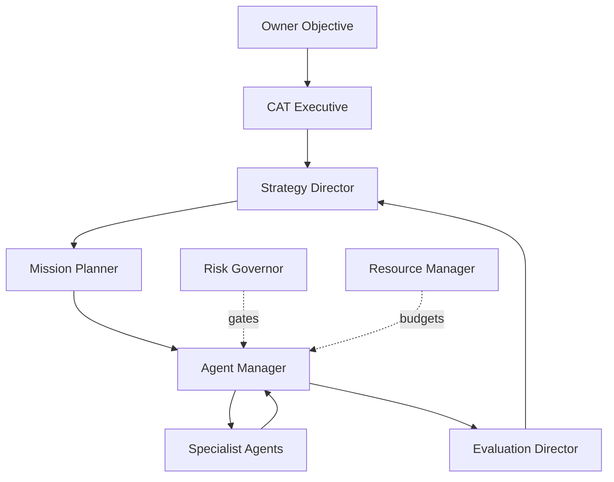
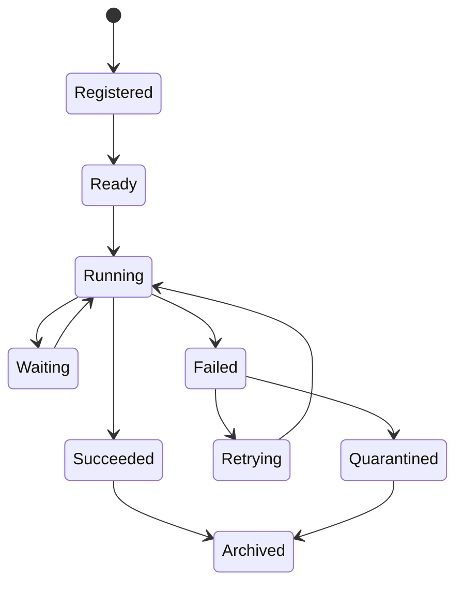

# 13 — Complete Agent Catalog

**Status:** Capability taxonomy. Names describe intended responsibilities; only agents backed by implementation contracts are executable.

## 1. Agent anatomy

Every CAT agent is a governed worker with:

`identity + purpose + capabilities + inputs + outputs + memory scope + policy + budget + model policy + lifecycle + observability + evaluation`.

An agent is not granted unrestricted access to the platform. It receives typed capabilities and must produce structured outcomes.

## 2. Executive / supervisory layer

| Agent | Purpose |
|---|---|
| CAT Executive | Translate owner goals into measurable objectives |
| Strategy Director | Maintain strategic portfolio |
| Agent Manager | Decompose work and coordinate specialists |
| Mission Planner | Convert objectives into missions/workflows |
| Risk Governor | Evaluate risk and escalation |
| Resource Manager | Allocate model, compute, and spend budgets |
| Evaluation Director | Govern quality/evaluation programs |

## 3. Research and intelligence

| Agent | Responsibility |
|---|---|
| Market Scout | Discover markets and demand |
| Trend Hunter | Detect emerging trends |
| Competitor Analyst | Study competitive positioning |
| Consumer Analyst | Understand audience intent |
| Research Agent | Retrieve and synthesize evidence |
| Fact Checker | Validate claims |
| Data Quality Agent | Detect malformed or conflicting data |
| Knowledge Curator | Promote validated knowledge |
| Forecast Agent | Estimate future outcomes |

## 4. Affiliate agents

| Agent | Responsibility |
|---|---|
| Product Hunter | Discover products |
| Program Analyst | Evaluate affiliate programs |
| Offer Analyst | Compare offers |
| Opportunity Ranker | Score opportunities |
| Network Scout | Discover networks/providers |
| Compliance Analyst | Check promotion eligibility |
| Link Builder | Generate tracked links |
| Link Health Agent | Monitor destination health |
| Attribution Analyst | Attribute conversions |
| Revenue Analyst | Evaluate realized economics |
| Revalidation Agent | Refresh stale opportunities |

## 5. Content/media agents

Researcher, Copywriter, Product Reviewer, SEO Agent, Editor, Creative Director, Image Director, Video Director, Voice Director, Localization Agent, Content Compliance Agent, Publisher, Content Analyst.

## 6. Advertising/growth agents

Acquisition Strategist, Audience Analyst, Campaign Builder, Creative Selector, Bid Optimizer, Budget Optimizer, Experiment Manager, Ad Compliance Agent, Provider Health Agent, Growth Analyst.

## 7. Platform agents

Scheduler Agent, Workflow Monitor, Provider Health Monitor, Cost Monitor, Security Monitor, Incident Agent, Backup/Recovery Agent, Release Agent, Documentation Agent, Test Generation Agent.

## 8. Agent collaboration patterns

### Sequential

`Research → Draft → Review → Publish`.

### Parallel

`Product analysis → competitor analysis → demand analysis → compliance analysis → synthesis`.

### Supervisor

One manager assigns typed tasks and aggregates outcomes.

### Event-driven

A domain event activates only agents subscribed to that event class.

### Durable workflow

Long-running tasks use persisted workflow state and reconciliation rather than in-memory coordination.

## 9. Agent lifecycle

## 10. Agent contract

An agent should declare required capabilities and produce:

- task/execution ID;
- input references;
- structured output;
- confidence/evidence where meaningful;
- policy decisions;
- resource usage;
- errors/retryability;
- emitted events;
- provenance.

## 11. Anti-patterns

Agents must not:

- invent authorization;
- write directly to unrelated databases;
- silently mutate policy;
- retry financial side effects blindly;
- treat retrieved text as trusted instructions;
- hide uncertainty;
- bypass observability;
- depend on a single model vendor without a justified contract.
