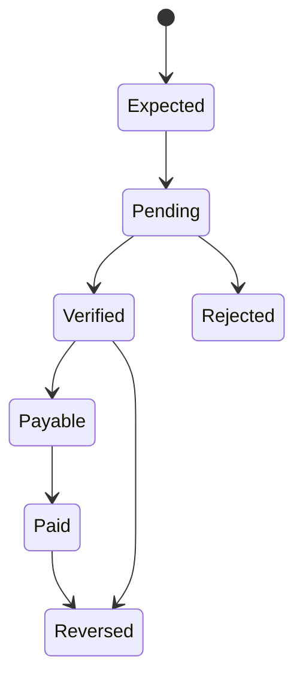

# 14 — Revenue, Treasury & Economics

**Status:** Target business architecture.

## 1. Economic mission

CAT exists to create durable positive economic contribution. Revenue is not synonymous with gross commissions. The economic model must include acquisition costs, provider fees, refunds, chargebacks, infrastructure, model/API costs, and operational risk.

## 2. Economic graph

## 3. Core metrics

| Metric | Meaning |
|---|---|
| EPC | Earnings per click |
| CTR | Click-through rate |
| CVR | Conversion rate |
| CAC | Acquisition cost |
| ROAS | Revenue relative to ad spend |
| Contribution | Revenue minus attributable costs |
| Net commission | Commission after reversals/fees |
| Payback | Time to recover acquisition spend |

CAT should optimize contribution and risk-adjusted return rather than maximizing any isolated metric.

## 4. Treasury boundaries

Treasury records realized financial facts and controlled allocations. Forecasts are never presented as cash. Pending commissions remain pending until verified by the applicable provider/accounting policy.

## 5. Financial state

## 6. Spend controls

Any autonomous spending path must have a budget, approval threshold, maximum loss, emergency stop, and reconciliation process. Budget decisions should be durable and auditable.

## 7. Attribution economics

Economic attribution must preserve raw touchpoints. Re-running an attribution model should be possible without rewriting the underlying conversion evidence.

## 8. Long-term objective

The first economic milestone is self-sustainability: CAT's realized contribution should cover its own infrastructure, model/provider costs, and maintenance before aggressive scaling. Growth beyond that is governed by risk-adjusted reinvestment.
