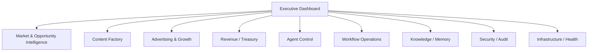

# 15 — Control Plane, UI/UX & Human Operations

**Status:** Target architecture.

## 1. Purpose

The Control Plane is the human command surface for CAT. It exposes system state, agent activity, opportunities, content, campaigns, economics, approvals, alerts, configuration, and audit history without requiring humans to understand internal implementation details.

## 2. Information architecture

## 3. Design principles

- High information density without visual noise.
- Progressive disclosure: simple summary first, evidence on demand.
- Every autonomous action is explainable.
- Clear distinction between observed, inferred, predicted, and proposed information.
- Accessible keyboard and screen-reader navigation.
- Responsive layouts for desktop and mobile.
- Fast perceived performance through streaming and incremental updates.

## 4. Command center

The executive view should answer:

1. What is CAT doing now?
2. Why is it doing it?
3. What changed?
4. What is earning money?
5. What is failing?
6. What requires approval?
7. Where is capital being allocated?
8. What evidence supports the next recommendation?

## 5. Approval UX

High-impact proposals should show action, expected benefit, downside/risk, evidence, policy, budget impact, provider, reversibility, and expiration time. Approval must be explicit and bound to the proposal version.

## 6. Agent observability

Humans should be able to inspect agent identity, mission, current task, tools used, memory references, model/provider, latency, cost, result, errors, and downstream effects without exposing secrets.

## 7. Visualization

Charts should prioritize decision usefulness: trends, confidence, distributions, funnels, attribution paths, cohort comparisons, budget allocation, and anomaly indicators. Decorative 3D/immersive experiences are optional and must never reduce accessibility or operational clarity.

## 8. Real-time updates

The UI can consume event-derived updates through WebSockets/SSE or polling depending on deployment constraints. Client state is derived from authoritative APIs/events and must tolerate reconnects and duplicate updates.
