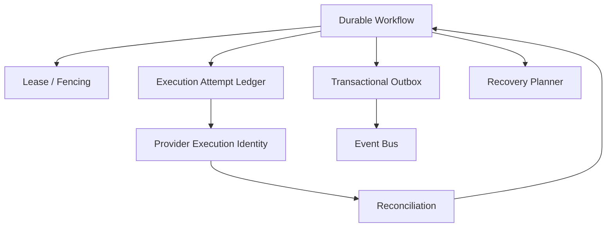
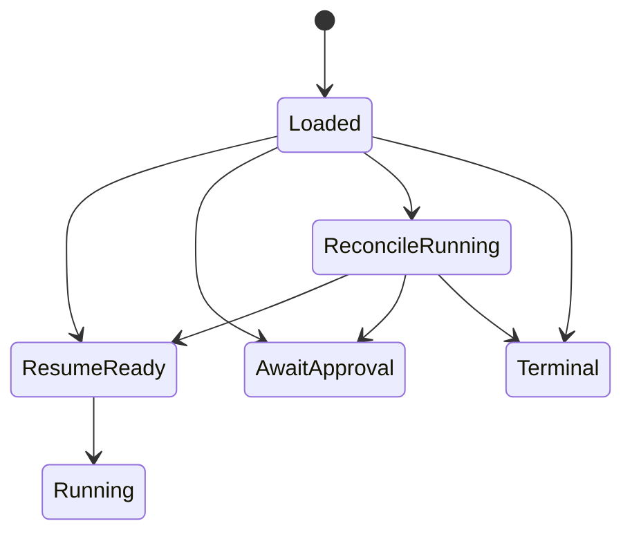

# 16 — Persistence, Reliability & Recovery

**Status:** Architecture specification aligned with durable-execution principles.

## 1. Reliability objective

CAT must survive process crashes, worker loss, network failures, duplicate delivery, provider timeouts, stale leases, partial publication, and restarts without silently duplicating economic side effects.

## 2. Reliability stack

## 3. Core rules

1. Every externally visible execution has a stable identity.
2. Retries are policy decisions, not generic loops.
3. A stale running task is reconciled before replay.
4. Fencing prevents an old worker from mutating current state.
5. Outbox publication is decoupled from transaction commit without losing the pending event.
6. Consumers tolerate duplicate delivery.
7. Provider lookup is preferred over blind resubmission when a provider supports remote execution lookup.

## 4. Failure matrix

| Failure | Expected response |
|---|---|
| Worker crash before commit | recover and reconcile |
| Provider timeout | lookup/reconcile |
| Event publish failure | retain outbox record |
| Duplicate event | idempotent consumer |
| Lease expiry | fence old owner |
| Permanent provider rejection | terminal policy outcome |
| Database restart | transaction recovery |
| Process restart | reload durable workflow |

## 5. Recovery states

## 6. Recovery is evidence-based

Recovery must not guess. The system reconstructs state from durable records, execution attempts, provider results, leases/fencing metadata, and event/outbox records. When evidence is insufficient, CAT should stop safely and escalate rather than inventing success or failure.

## 7. PostgreSQL role

PostgreSQL is the primary durable transactional substrate for state requiring relational consistency. Migrations are versioned and additive where possible. Integration tests must exercise real database behavior when the feature depends on database semantics.

## 8. Backup and restore

Backups are only useful when restore works. CAT requires tested restore procedures, migration compatibility, retention policies, and documented recovery objectives for critical data.
