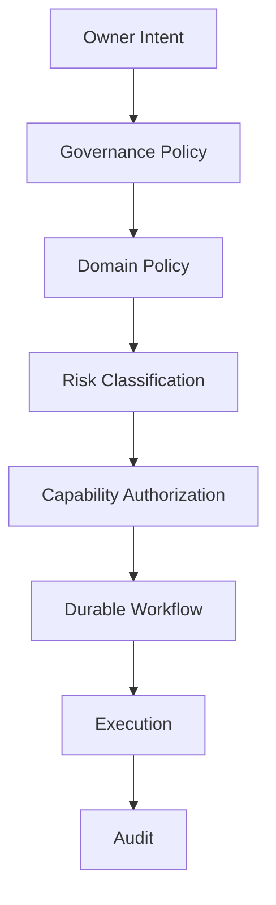

# 17 — Governance & Human-in-the-Loop

**Status:** Target governance architecture.

## 1. Why governance is part of the product

CAT can influence money, reputation, external accounts, published claims, and business relationships. Governance therefore belongs inside the execution architecture rather than being an afterthought in the UI.

## 2. Policy hierarchy

Lower-level components cannot weaken a higher-level policy.

## 3. Approval classes

| Class | Example | Default |
|---|---|---|
| R0 | read-only analysis | autonomous |
| R1 | reversible low-cost action | autonomous within policy |
| R2 | public content publication | policy / optional approval |
| R3 | paid acquisition | bounded approval |
| R4 | financial or legal commitment | explicit human approval |
| R5 | security/destructive action | privileged human approval |

## 4. Policy evaluation

A policy decision should expose: decision ID, policy version, subject, actor/agent, requested capability, resource, risk class, budget impact, constraints, decision, reason codes, and expiration.

## 5. Human approval semantics

Approval is bound to a specific proposal version. If material inputs change, the approval becomes invalid and a new approval is required. Approval records must be durable and auditable.

## 6. Kill switches

CAT needs emergency controls at multiple scopes:

- global execution stop;
- agent stop;
- provider stop;
- campaign stop;
- financial-spend stop;
- publication stop.

Kill switches must be simpler and more reliable than the systems they stop.

## 7. Governance of self-improvement

CAT can propose changes to prompts, routing, scoring, or configuration, but safety policies, authorization boundaries, and audit requirements cannot be self-weakened. Changes to core governance require explicit owner authority and regression evaluation.

## 8. Audit principle

The question after any consequential action should be answerable: **who/what proposed it, why, using which evidence, under which policy, with which authorization, what happened, and what was learned?**
