# 18 — Roadmap, Evolution & Maturity

**Status:** Strategic roadmap framework; dates are intentionally not commitments.

## 1. Evolution principle

CAT evolves by capability maturity, evidence, and economic value. New technology is adopted when it improves a measurable property without compromising existing contracts.

## 2. Capability maturity path

```mermaid
gantt
    title CAT Capability Maturity Model
    dateFormat X
    axisFormat %s
    section Foundation
    Kernel + contracts       :done, 0, 1
    Durable execution        :done, 1, 2
    section Intelligence
    Knowledge + memory       :2, 4
    Agent coordination       :3, 5
    Evaluation               :4, 6
    section Commerce
    Affiliate intelligence   :4, 7
    Content factory          :5, 8
    Advertising OS           :6, 9
    Revenue optimization     :7, 10
    section Scale
    Self-hosted infrastructure :7, 9
    Cluster orchestration      :9, 12
    Continuous optimization    :10, 14
```

The chart is conceptual, not a delivery schedule.

## 3. Phases

### Phase I — Trustworthy substrate

Kernel, events, persistence, workflow durability, provider boundaries, testing, observability, security foundations.

### Phase II — Economic intelligence

Discovery, affiliate programs/offers, ranking, attribution, content, analytics, and controlled distribution.

### Phase III — Autonomous growth

Advertising, experiments, portfolio optimization, forecasting, and bounded autonomous execution.

### Phase IV — Organization in software

Multi-agent management, continuous learning, advanced simulations, multi-provider resilience, and scalable infrastructure.

## 4. Technology evolution rules

A technology may be introduced when it has a documented problem statement, alternatives analysis, operational owner, migration path, rollback plan, security assessment, and measurable benefit.

## 5. Backward compatibility

Contracts should evolve additively whenever practical. Breaking changes require explicit versioning, migration guidance, compatibility tests, and an ADR.

## 6. Definition of mature

A CAT capability is mature when it is:

`documented → contracted → implemented → tested → observable → recoverable → economically evaluated`.

## 7. Long-term direction

The end state is not maximum complexity. It is a system where additional agents, providers, markets, channels, and workloads can be added mostly through contracts and configuration rather than rewriting the core.
