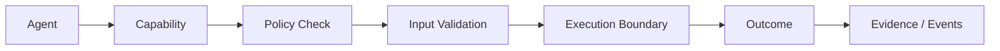
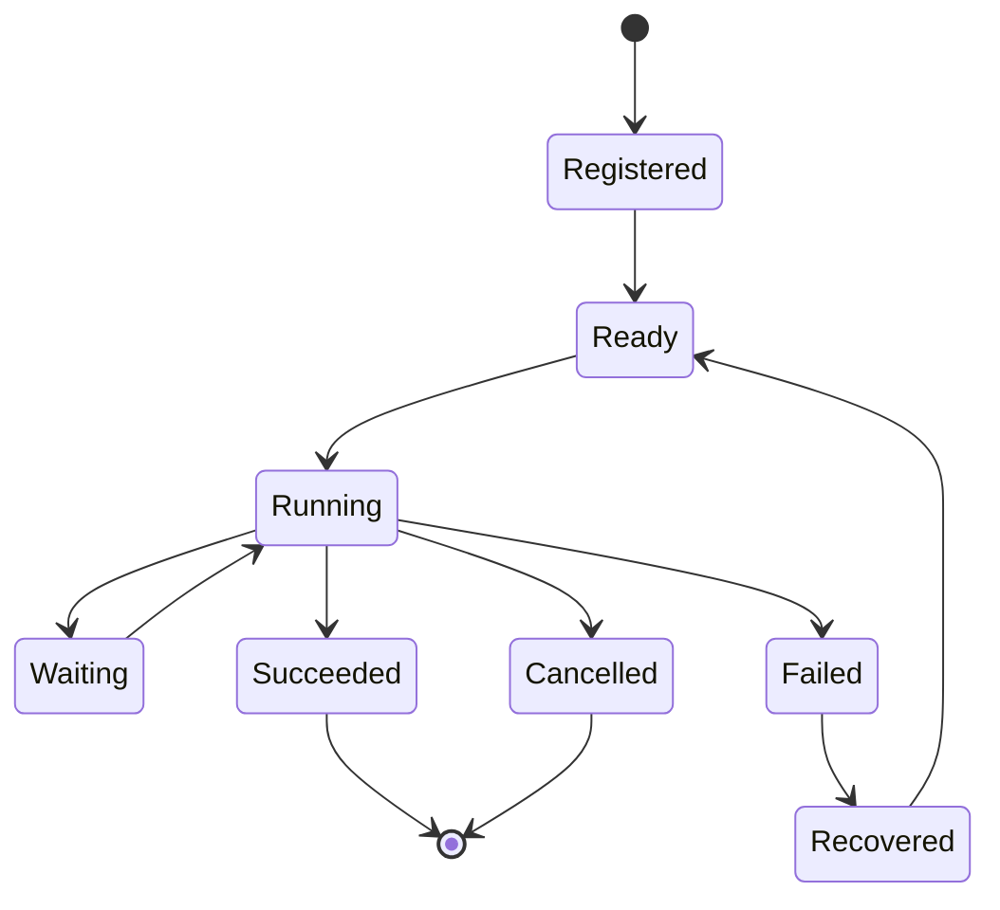
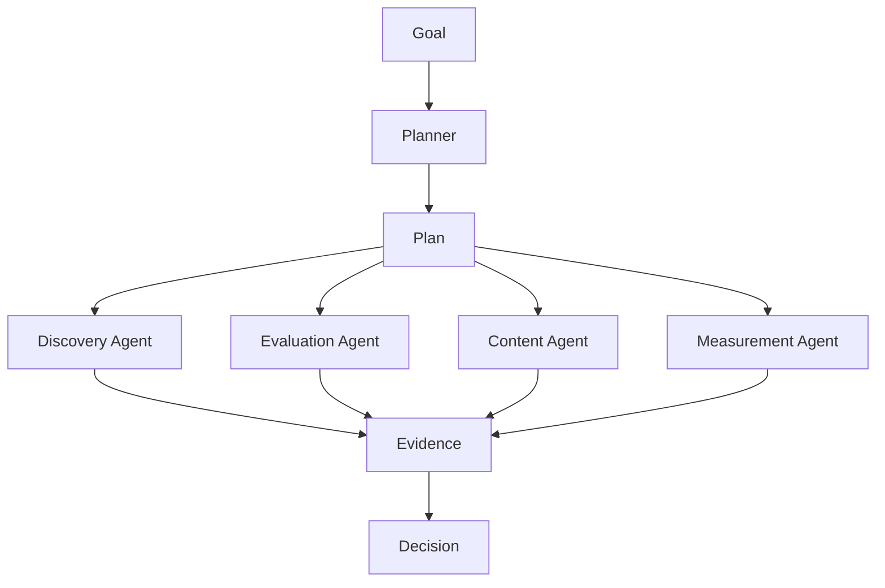

# 19 — Agent SDK & Capability Protocol

**Status:** Target architecture; implementation status must be verified against executable code and contracts.

## 1. Purpose

CAT agents are not free-form chat personas. An agent is a governed execution component with a declared identity, capabilities, inputs, outputs, authority, resource policy, memory policy, observability contract, and lifecycle.

The Agent SDK is the conceptual boundary that allows CAT to add specialist agents without coupling business logic to a particular LLM, vendor, transport, or orchestration implementation.

## 2. Agent contract

```text
Agent = Identity + Capabilities + Policy + Context + State + Execution + Evidence
```

| Element | Responsibility |
|---|---|
| Identity | Stable agent ID, version and role |
| Capabilities | Explicit operations the agent may perform |
| Policy | Authorization, risk and budget limits |
| Context | Task, tenant/profile, retrieved knowledge and relevant state |
| State | Ephemeral execution state plus durable references |
| Execution | Deterministic boundary around tools/providers |
| Evidence | Inputs, outputs, decisions and provenance |

## 3. Capability model

A capability is a named, versioned contract—not merely a tool call.



Each capability should define:

- stable identifier;
- semantic version;
- required inputs;
- output schema;
- preconditions;
- authorization requirements;
- side effects;
- idempotency semantics;
- timeout/retry behavior;
- compensation/reconciliation behavior;
- observability fields;
- security classification.

## 4. Tool versus capability

| Tool | Capability |
|---|---|
| Concrete mechanism | Business/operational contract |
| Provider-specific | Provider-independent |
| May change frequently | Versioned compatibility boundary |
| Performs an operation | Defines what an agent is allowed to accomplish |

Example: an HTTP client is a tool. `affiliate.offer.discover` is a capability.

## 5. Invocation envelope

Conceptual envelope:

```json
{
  "capability": "affiliate.offer.discover",
  "version": "1.x",
  "request_id": "stable-request-id",
  "actor": "agent.discovery",
  "correlation_id": "workflow-or-business-correlation",
  "input": {},
  "constraints": {
    "max_cost_minor": 0,
    "deadline_ms": 0
  }
}
```

The actual production schema is authoritative only when implemented in repository contracts.

## 6. Agent lifecycle



## 7. Capability composition

Capabilities may be composed into plans, but composition must preserve authorization boundaries. A parent agent must not gain capabilities merely because a child agent possesses them.



## 8. Failure semantics

Agents must distinguish:

- invalid input;
- unavailable dependency;
- policy denial;
- transient failure;
- permanent failure;
- timeout;
- partial result;
- uncertain external outcome;
- cancellation;
- human approval required.

An uncertain external outcome must never be treated as a clean failure that is safe to replay blindly.

## 9. Security invariants

1. Least privilege by capability.
2. Secrets never enter prompts unless explicitly required and authorized.
3. Agent output is untrusted input to downstream systems.
4. High-impact side effects require policy evaluation.
5. Every consequential invocation has correlation and provenance metadata.
6. Provider credentials remain outside business-domain prompts.

## 10. Versioning

Capability versions should evolve independently from agent versions. Breaking changes require a new major contract or an explicit migration strategy.

## 11. SDK design target

A future SDK should make the safe path the easy path:

```text
register agent
  -> declare capabilities
  -> declare policies
  -> receive typed context
  -> invoke governed capability
  -> emit evidence
  -> return typed result
```

No SDK abstraction may bypass the durable orchestration, authorization, observability, or reconciliation boundaries where those boundaries apply.