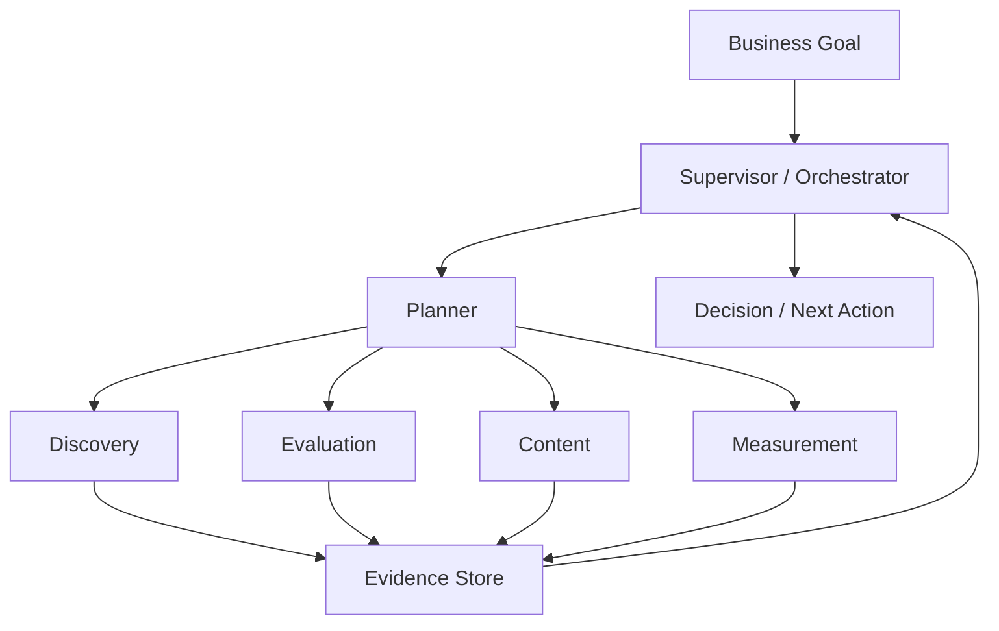
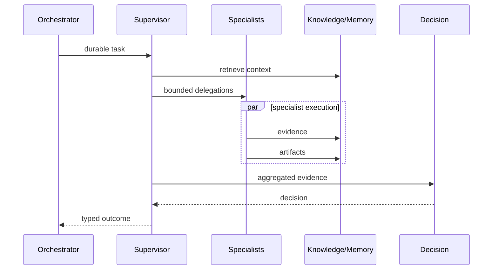

# 20 — Agent Collaboration & Multi-Agent Orchestration

**Status:** Target architecture.

## 1. Objective

CAT must coordinate many specialist agents as one economic operating system while preventing duplicated work, conflicting actions, uncontrolled recursion, and ambiguous ownership.

## 2. Collaboration patterns

| Pattern | Use |
|---|---|
| Sequential | Output of one specialist becomes input to another |
| Parallel | Independent evidence collection |
| Hierarchical | Supervisor delegates bounded tasks |
| Event-driven | Agents react to durable events |
| Competitive | Multiple strategies are evaluated |
| Consensus | Independent agents provide evidence before a decision |
| Black-board | Shared structured state, not unrestricted conversation |

## 3. Supervisor model



The supervisor coordinates; specialists own bounded expertise. No specialist should silently mutate another specialist's state.

## 4. Shared context

Agents should exchange typed artifacts rather than large uncontrolled conversational transcripts.

```text
TaskContext
├── objective
├── constraints
├── authorized_capabilities
├── relevant_memory_refs
├── knowledge_refs
├── prior_artifacts
├── correlation_id
└── deadline
```

## 5. Conflict resolution

When agents disagree:

1. preserve both claims;
2. compare provenance and freshness;
3. evaluate confidence and evidence quality;
4. request targeted verification if necessary;
5. escalate high-impact unresolved conflicts;
6. never overwrite evidence merely to reach consensus.

## 6. Delegation contract

A delegation should define:

| Field | Meaning |
|---|---|
| task_id | Unique task identity |
| parent_task_id | Delegation lineage |
| objective | Expected outcome |
| allowed_capabilities | Maximum authority |
| budget | Cost/resource ceiling |
| deadline | Execution boundary |
| success criteria | Acceptance conditions |
| return artifacts | Required structured outputs |

## 7. Anti-patterns

CAT must avoid:

- infinite agent-to-agent recursion;
- unrestricted capability inheritance;
- hidden side effects in analysis agents;
- agents communicating only through natural language when a schema exists;
- duplicated external submissions;
- shared mutable state without ownership;
- consensus by majority without evidence.

## 8. Idempotency and concurrency

Parallel agents may discover the same opportunity or produce equivalent content. Deduplication belongs at the relevant domain boundary. Orchestration must provide stable execution identities so retries do not become duplicate side effects.

## 9. Collaboration observability

Every delegation should be traceable through:

```text
root correlation
  -> parent task
      -> child task
          -> capability invocation
              -> provider execution
                  -> outcome
```

This lineage is essential for debugging, economics, and learning.

## 10. Economic coordination

Agent selection should eventually account for expected value, confidence, latency, resource cost, and risk—not merely model quality. A more expensive model is justified only when expected incremental value exceeds its cost and policy permits it.

## 11. Human escalation

Multi-agent autonomy stops at policy boundaries. Examples include financial commitments, irreversible publishing, credential changes, legal/compliance uncertainty, and other owner-defined high-impact actions.

## 12. Target operating loop



The exact production protocol must be implemented through repository contracts rather than assumed from this chapter.