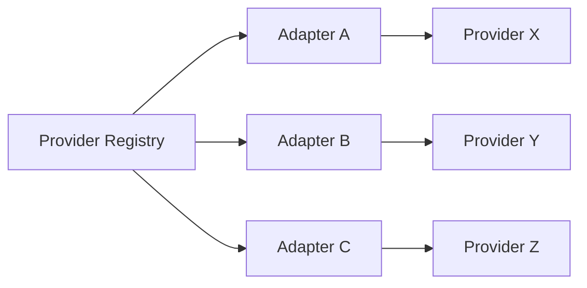
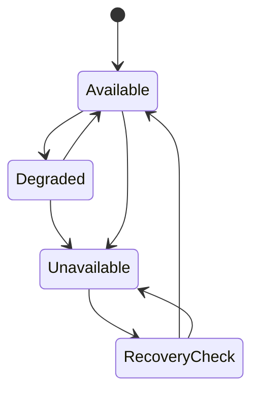

# 21 — Tool, Connector & Provider Ecosystem

**Status:** Target architecture; existing provider contracts remain authoritative.

## 1. Principle

CAT must be able to replace an external provider without rewriting business logic. Providers are replaceable execution mechanisms behind stable CAT contracts.

## 2. Layers

```text
Agent
  ↓
Capability
  ↓
Domain Service
  ↓
Provider / Connector SPI
  ↓
Adapter
  ↓
External System
```

## 3. Definitions

| Term | Definition |
|---|---|
| Tool | Concrete callable mechanism |
| Connector | Integration package connecting CAT to an external system |
| Provider | External or internal implementation offering a capability |
| Adapter | CAT-owned translation layer around a provider |
| SPI | Stable interface that isolates business logic from implementations |

## 4. Provider registry

The repository already contains provider selection/registry concepts for execution. This Bible extends the same architectural principle to the broader ecosystem without replacing existing contracts.



## 5. Provider metadata

A provider declaration should expose, where relevant:

- identity and version;
- supported capabilities;
- geographic scope;
- currencies;
- rate limits;
- latency characteristics;
- reliability history;
- pricing;
- authentication mechanism;
- idempotency support;
- lookup/reconciliation support;
- asynchronous completion support;
- cancellation support;
- compliance constraints.

## 6. Selection

Provider selection is a decision, not a hard-coded if/else tree.

Target score dimensions:

| Dimension | Question |
|---|---|
| Capability | Can it perform the operation? |
| Reliability | Does it succeed consistently? |
| Economics | What is expected value/cost? |
| Latency | Does it satisfy the deadline? |
| Geography | Is the market supported? |
| Compliance | Is use permitted? |
| Resilience | Can uncertain results be reconciled? |

## 7. Credential isolation

Credentials belong to infrastructure/integration boundaries. Agents receive authorization to invoke capabilities; they should not receive raw provider secrets unless a narrowly defined capability requires it.

## 8. Provider failure



Selection must exclude providers that cannot satisfy mandatory capability or safety requirements.

## 9. Anti-lock-in rule

Business objects must not contain provider-specific semantics unless the provider-specific data is explicitly represented as metadata/provenance. Domain contracts should survive provider replacement.

## 10. Integration testing

Every connector should have:

1. contract tests;
2. deterministic fake/stub tests;
3. malformed-input tests;
4. timeout/retry tests;
5. authentication-failure tests;
6. rate-limit tests;
7. idempotency tests;
8. reconciliation tests where applicable.

## 11. Lifecycle

```text
Discover → Register → Validate → Activate → Observe → Degrade/Disable → Replace
```

## 12. Future ecosystem

Potential connector families include affiliate networks, merchants, search/data providers, LLMs, image/media systems, publishing platforms, advertising platforms, analytics systems, payment/treasury services, communication channels, and internal infrastructure.

No specific provider is a permanent architectural dependency.