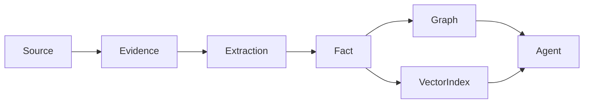
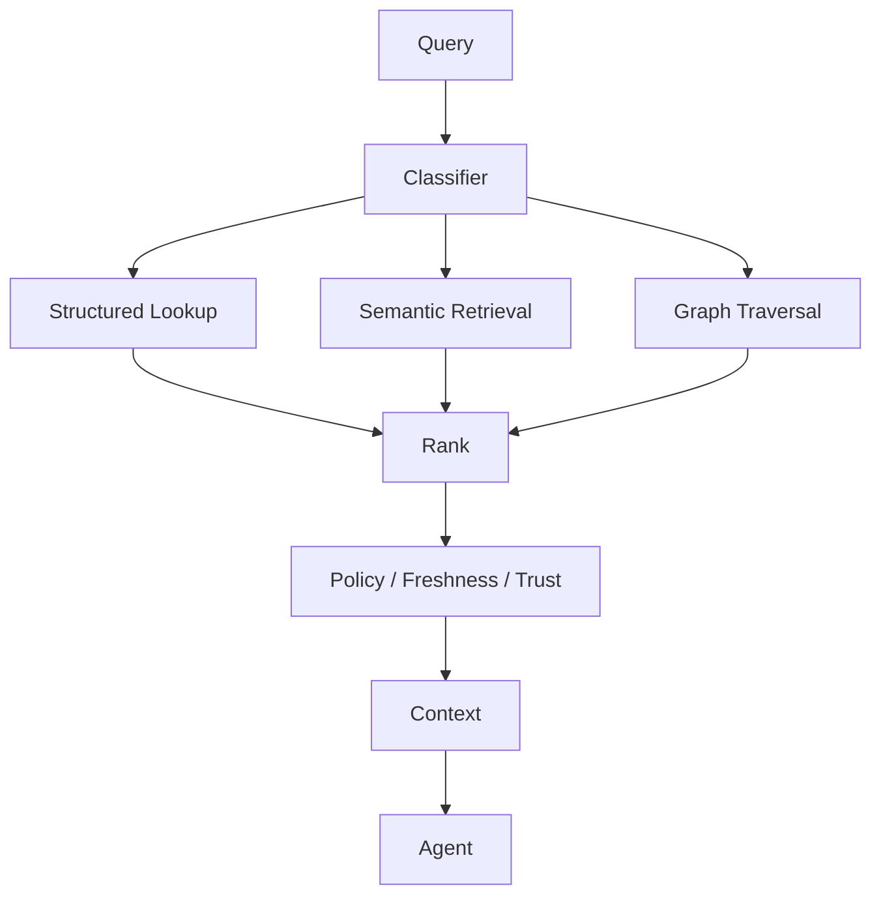
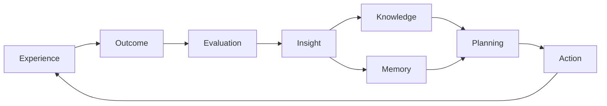

# 22 — Knowledge Graph, RAG & Memory System

**Status:** Target architecture, grounded in the repository's knowledge/memory/RAG packages and research direction.

## 1. Three kinds of intelligence state

```text
Knowledge = what CAT believes about the world
Memory   = what CAT remembers from experience
Learning = how evidence changes behavior
```

These must not be collapsed into one vector database.

## 2. Knowledge layers

| Layer | Purpose |
|---|---|
| Raw evidence | Original observation/document |
| Structured facts | Normalized entities and relations |
| Knowledge graph | Explicit relationships |
| Embeddings | Semantic retrieval |
| Derived insight | Higher-level conclusions |
| Policy knowledge | Rules and constraints |

## 3. Provenance

Every material fact should be traceable to evidence:



Recommended metadata:

- source;
- observed_at;
- published_at when available;
- extraction method;
- confidence;
- freshness;
- jurisdiction;
- entity identifiers;
- supersession/retraction state.

## 4. Memory taxonomy

| Memory | Lifetime | Example |
|---|---|---|
| Working | task | current plan context |
| Episodic | long-term | result of a campaign |
| Semantic | long-term | learned merchant property |
| Procedural | long-term | effective operating procedure |
| Preference | durable | owner-defined preferences |
| Operational | lifecycle | workflow/execution state |

## 5. Retrieval pipeline



## 6. RAG requirements

RAG must optimize for useful evidence, not maximum document count. Retrieval should consider semantic relevance, authority, freshness, provenance, contradiction, and task scope.

## 7. Contradictions

Conflicting facts are first-class state.

```text
Fact A
  confidence 0.80
  source S1

Fact B
  confidence 0.70
  source S2

→ preserve both
→ compare provenance/freshness
→ resolve or represent uncertainty
```

The system must not silently overwrite one source with another.

## 8. Memory write policy

Not every interaction deserves durable memory. A memory candidate should pass relevance, durability, privacy, provenance, and utility criteria.

## 9. Forgetting and supersession

Knowledge can expire. Memory can become obsolete. CAT should model supersession explicitly rather than deleting history merely because a newer value exists.

## 10. Retrieval security

Documents and retrieved content are untrusted data. Prompt injection inside retrieved content must not override system policy, authorization, or capability boundaries.

## 11. Learning loop



## 12. Target invariants

1. Evidence remains traceable.
2. Retrieval never grants authority.
3. Memory does not override explicit policy.
4. Stale knowledge is identifiable.
5. Model/provider changes do not destroy canonical facts.
6. Embeddings are derived representations, not the sole source of truth.
7. Learning requires measurable evidence.

## 13. Knowledge graph target

The graph may represent entities such as products, merchants, networks, audiences, markets, content, channels, campaigns, agents, providers, observations, outcomes and relationships among them.

The exact graph schema should be introduced through versioned contracts and migrations rather than inferred from this conceptual chapter.