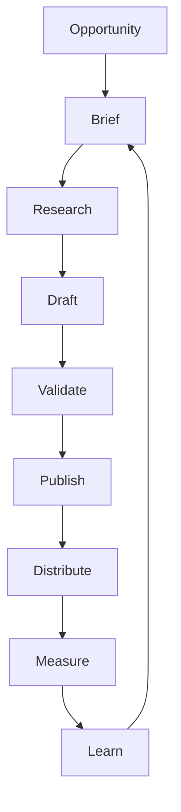
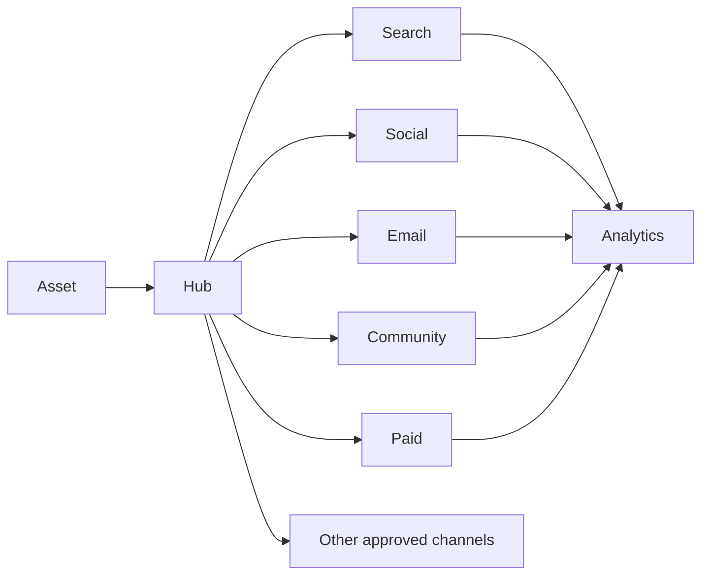

# 24 — Content, Distribution & Growth Engine

**Status:** Target architecture.

## 1. Principle

CAT should treat content as an experiment-driven economic asset, not as a sequence of generated articles.

## 2. Content lifecycle



## 3. Content object

A content asset should eventually have:

- stable ID and version;
- source opportunity references;
- audience;
- intent;
- language/locale;
- format;
- channel;
- evidence/provenance;
- claims;
- affiliate references;
- compliance state;
- publication state;
- performance metrics.

## 4. Generation pipeline

| Stage | Responsibility |
|---|---|
| Briefing | define objective and audience |
| Research | gather evidence |
| Composition | create candidate asset |
| Fact validation | check claims |
| Commercial validation | verify offers/links |
| Compliance | disclosures and policy checks |
| Quality | language/format/accessibility |
| Publication | controlled release |
| Measurement | observe outcome |

## 5. Distribution graph



Channels are adapters; the content model remains channel-independent.

## 6. Experimentation

CAT should support controlled variants:

```text
Asset A → baseline
Asset B → title variant
Asset C → audience variant
Asset D → format variant
```

Experiments need explicit hypotheses, metrics, duration/sample boundaries, and rollback rules.

## 7. Quality gates

Publication should be blocked when required evidence, policy, attribution, or content integrity checks fail.

## 8. Growth loop

```text
Discover → Create → Distribute → Measure → Learn → Reallocate → Discover
```

The growth engine must optimize toward durable economic value, not vanity metrics alone.

## 9. Content economics

Track at least:

- generation cost;
- publication cost;
- distribution cost;
- impressions;
- qualified visits;
- clicks;
- conversions;
- revenue;
- commission;
- contribution margin;
- retention/repeat value where measurable.

## 10. AI safety

Generated claims must be treated as untrusted until validated against appropriate evidence. Retrieved content cannot override system policy. Affiliate disclosure and platform rules are mandatory constraints.

## 11. Localization

Content should support locale, language, market, currency, cultural constraints, and channel-specific formatting as explicit dimensions rather than hidden prompt instructions.