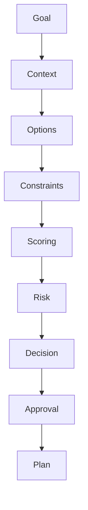
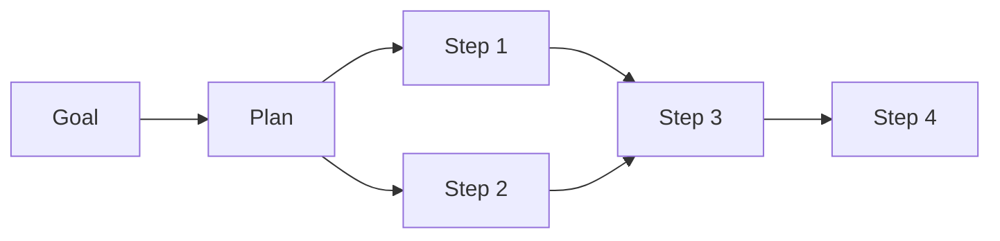

# 25 — Decision, Planning & Autonomy Engine

**Status:** Architecture chapter; existing planning/decision/orchestration contracts remain authoritative.

## 1. Separation of concerns

```text
Reasoning → what may be true / what could work
Decision  → what should be chosen
Planning  → how to achieve the choice
Orchestration → how execution is durably coordinated
Worker → performs bounded work
```

No layer should silently absorb another layer's responsibility.

## 2. Decision pipeline



## 3. Decision record

A consequential decision should preserve:

- objective;
- alternatives considered;
- constraints;
- evidence references;
- scoring/rationale;
- confidence;
- policy result;
- expected outcome;
- selected action;
- model/provider metadata where relevant.

## 4. Planning

A plan is an executable strategy represented as explicit steps and dependencies.



Dependencies must be explicit and deterministic.

## 5. Autonomy levels

| Level | Description |
|---|---|
| A0 | Human performs action |
| A1 | AI recommends |
| A2 | AI prepares, human approves |
| A3 | AI executes low-risk bounded actions |
| A4 | AI manages multi-step objectives under policy |
| A5 | Continuous autonomous optimization with governed escalation |

A higher autonomy level requires stronger observability, policy, recovery, evaluation, and evidence.

## 6. Risk-aware autonomy

```text
Expected utility
    vs.
Risk × uncertainty × impact
```

The system should reduce autonomy when uncertainty or impact rises.

## 7. Durable execution

Plans that create external side effects should use durable orchestration and stable execution identities. Retries belong to orchestration policy; workers should not invent their own workflow transitions.

## 8. Waiting

A workflow may legitimately wait for:

- human approval;
- external asynchronous completion;
- scheduled time;
- missing information;
- rate-limit recovery.

Waiting is a state, not a failure.

## 9. Replanning

Replanning should be triggered by meaningful state changes, not every minor observation. A replan must preserve already completed valid work and avoid replaying irreversible external effects without reconciliation.

## 10. Goal hierarchy

```text
Mission
  ↓
Strategic objective
  ↓
Business objective
  ↓
Tactical objective
  ↓
Workflow
  ↓
Step
  ↓
Provider execution
```

Each lower level must remain consistent with the constraints inherited from the higher level.

## 11. Autonomy invariant

**Autonomy is permission to act within a boundary, not permission to redefine the boundary.**

System policy, owner constraints, compliance rules, security controls, and explicit approvals remain superior to agent preference.