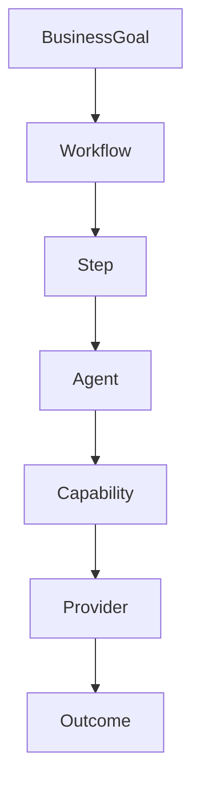
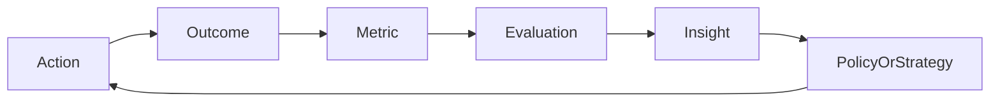

# 26 — Observability, Evaluation & Operations

**Status:** Architecture target, aligned with the system's event-driven and durable-execution direction.

## 1. Observability model

CAT must answer four questions:

1. What happened?
2. Why did it happen?
3. What did it cost?
4. What should change next time?

## 2. Three pillars

```text
Logs + Metrics + Traces
        ↓
     Evidence
        ↓
Operational understanding
```

Business events and decision records complement technical telemetry.

## 3. Correlation



A common correlation/causation lineage should make this path reconstructable.

## 4. Metrics taxonomy

| Class | Examples |
|---|---|
| System | CPU, memory, latency |
| Workflow | duration, retries, stuck workflows |
| Agent | task success, latency, cost |
| Provider | availability, errors, latency |
| Affiliate | opportunities, clicks, conversions |
| Content | publication, engagement, revenue |
| Economics | cost, commission, contribution |
| Safety | policy denials, escalations |

## 5. Evaluation

Evaluation must measure outcomes, not merely model confidence.



## 6. Experiment records

Each experiment should identify:

- hypothesis;
- baseline;
- variant;
- target population;
- metrics;
- stopping conditions;
- statistical/decision method;
- cost boundary;
- conclusion;
- follow-up action.

## 7. Incident model

```text
Detect → Triage → Contain → Diagnose → Recover → Verify → Learn
```

Recovery must preserve evidence. Incident cleanup must not erase the history needed to understand causation.

## 8. SLO-oriented targets

Future operational definitions may include:

- workflow completion reliability;
- event delivery reliability;
- provider reconciliation latency;
- opportunity freshness;
- content publication success;
- data pipeline freshness;
- control-plane availability.

Exact numerical SLOs belong in operational contracts once production requirements are known.

## 9. Cost observability

AI systems require explicit cost telemetry:

```text
request
 → model/provider
 → tokens or media units
 → latency
 → direct cost
 → business outcome
```

Cost should be attributable to an agent, workflow, capability, campaign, or business objective whenever possible.

## 10. Alerting

Alerts should be actionable. Prefer alerts for violated invariants, sustained SLO degradation, economic anomalies, security events, and stuck durable work over noisy raw thresholds.

## 11. Operational dashboard target

```text
System Health
├── Workflows
├── Agents
├── Providers
├── Data freshness
├── Affiliate opportunities
├── Content
├── Revenue
├── Costs
└── Security / Governance
```

## 12. Learning from operations

Operational failures and successes are evidence for engineering improvement. However, automatic learning must pass governance controls before changing safety boundaries or irreversible behavior.