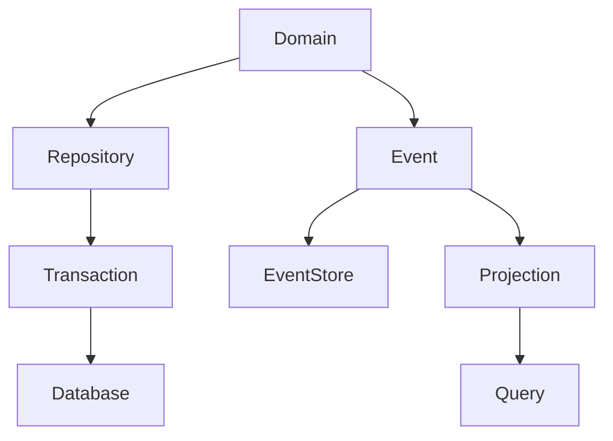

# 27 — Database & Domain Model

**Status:** Conceptual architecture; actual schemas and migrations are authoritative.

## 1. Data principles

CAT separates canonical state, derived projections, transient execution state, evidence, telemetry, and caches.

## 2. Data classes

| Class | Source of truth? | Typical role |
|---|---|---|
| Domain state | Yes | business truth |
| Event history | Yes where event-sourced | immutable history |
| Projection | No | query/read optimization |
| Cache | No | performance |
| Vector index | No | semantic retrieval |
| Telemetry | Operational evidence | observability |
| External snapshot | No | provider observation |

## 3. Domain boundary



## 4. Identity

Identifiers must be stable within their intended scope. External provider IDs must remain distinct from CAT canonical IDs.

## 5. Versioning

Domain records with changing semantics should carry explicit versions or revision semantics. Schema migrations must be additive and reversible where practical.

## 6. Transactions

A transaction should protect the smallest consistency boundary that genuinely requires atomicity. Distributed side effects should not be faked as database transactions; use durable outbox, idempotency, and reconciliation patterns instead.

## 7. Event history

Events represent facts that occurred. Commands express desired actions. Decisions express selected intent. These concepts should not be conflated.

```text
Command → Decision → State change → Event
```

## 8. Query model

Read models may denormalize data for efficient dashboards, ranking, search, or operational queries. They remain rebuildable from canonical state whenever the architecture permits.

## 9. Data retention

Retention should consider legal requirements, operational utility, storage cost, privacy, and learning value. Deletion policies must not accidentally remove required audit evidence.

## 10. Concurrency

Where multiple workers can modify the same aggregate, use explicit concurrency control such as optimistic revisions, database locking, or deterministic ownership. Silent last-write-wins is not acceptable for high-impact business state.

## 11. Backup and recovery

Production data requires:

- automated backups;
- restore verification;
- migration discipline;
- point-in-time recovery where justified;
- disaster-recovery documentation;
- recovery objectives.

## 12. Data quality

Every ingestion pipeline should validate identity, types, ranges, timestamps, provenance, and business invariants before durable persistence.

## 13. Privacy

Sensitive data should be minimized, access-controlled, encrypted where appropriate, and excluded from logs/prompts unless necessary. Data classification must precede broad agent access.