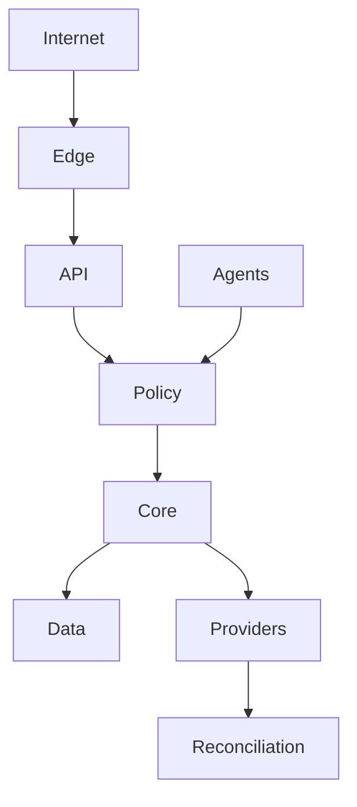

# 28 — Security, Privacy & Threat Model

**Status:** Architecture baseline; security controls in executable contracts override this chapter.

## 1. Security objective

CAT is an autonomous economic system. Security therefore includes not only confidentiality and integrity, but prevention of unauthorized economic actions.

## 2. Trust zones



## 3. Threat categories

| Threat | Primary defense |
|---|---|
| Credential theft | secret isolation, rotation |
| Prompt injection | trust boundaries, instruction hierarchy |
| Tool abuse | capability authorization |
| Duplicate side effect | idempotency |
| Unknown external outcome | reconciliation |
| Data poisoning | provenance/evaluation |
| Supply-chain compromise | dependency pinning/auditing |
| Privilege escalation | least privilege |
| Insider misuse | audit + authorization |
| Economic abuse | budgets and policy gates |

## 4. Zero-trust agent principle

An agent is not trusted merely because CAT created it. Every consequential capability invocation is evaluated against identity, capability, context, policy, and resource limits.

## 5. Secrets

Secrets must never be committed to Git, embedded in frontend assets, copied into durable prompts, or written to normal logs. Integrations should retrieve credentials through a controlled secret boundary.

## 6. Prompt security

Retrieved pages, documents, emails, product feeds, reviews, and provider responses are data. They may contain instructions designed to manipulate an agent. Data must never automatically become policy.

## 7. Economic authorization

```text
Agent intent
   ↓
Capability authorization
   ↓
Risk classification
   ↓
Budget check
   ↓
Policy evaluation
   ↓
Approval if required
   ↓
Execution
```

## 8. Privacy

Data collection must have a purpose. CAT should minimize personal data, define retention, restrict access, and avoid exposing private information to external model providers without explicit authorization.

## 9. Auditability

Security-relevant actions should generate durable audit evidence containing actor identity, capability, target, decision/policy result, correlation ID, timestamp, and outcome where appropriate.

## 10. Supply chain

Dependencies, container images, GitHub Actions, providers, and external APIs are part of the attack surface. Future production hardening should include vulnerability scanning, provenance verification, minimal permissions, and controlled upgrades.

## 11. Incident response

```text
Detect → Contain → Preserve Evidence → Revoke/Rotate → Recover → Verify → Review
```

## 12. Security invariants

1. No unauthenticated high-impact action.
2. No capability escalation through prompt text.
3. No secret disclosure through ordinary agent output.
4. No blind replay of uncertain external operations.
5. No silent modification of audit history.
6. No security decision based solely on untrusted generated text.

## 13. Compliance boundary

Legal and platform compliance requirements are deployment-specific and must be represented as explicit policy/configuration where relevant. This Bible does not claim legal compliance by documentation alone.