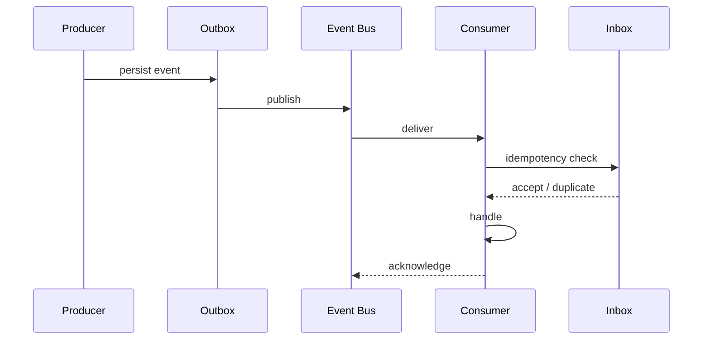

# 29 — API, Event Bus & Integration Contracts

**Status:** Target architecture aligned with existing event-driven implementation.

## 1. Contract hierarchy

```text
Public API
   ↓
Application command/query
   ↓
Domain service
   ↓
Event / durable state
   ↓
Integration adapter
```

## 2. Commands, events and queries

| Artifact | Intent |
|---|---|
| Command | Request a state-changing action |
| Event | Fact that something happened |
| Query | Read current/derived state |
| Integration message | Contract exchanged with an external system |

## 3. Event envelope

The existing event architecture uses an envelope containing identity, type/version, timing, producer, correlation/causation and subject information. New events should preserve those semantics.



## 4. Delivery semantics

Consumers should assume at-least-once delivery unless an explicit contract proves otherwise. Therefore handlers must be idempotent.

## 5. Inbox/outbox

The outbox closes the database-to-message publication gap. The inbox protects consumers against duplicate deliveries.

```text
transaction
├── domain state
└── outbox event
       ↓
publisher
       ↓
event bus
       ↓
inbox + handler
```

## 6. Versioning

Event type and schema versions are part of compatibility. Consumers should tolerate additive evolution where the contract permits it.

## 7. API design

APIs should expose business operations, not internal database tables. Every mutating endpoint requires authentication, authorization, validation, idempotency semantics where applicable, and auditability for consequential actions.

## 8. External integration

External systems are unreliable. Integrations need explicit handling for:

- timeout;
- throttling;
- authentication failure;
- malformed payload;
- partial success;
- asynchronous completion;
- unknown outcome;
- schema drift.

## 9. Contract testing

Provider and event consumers should have contract tests that run independently of live credentials whenever possible.

## 10. Integration rule

**Never let an external API response become canonical business truth without normalization, validation, provenance, and appropriate persistence semantics.**