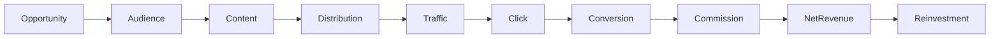
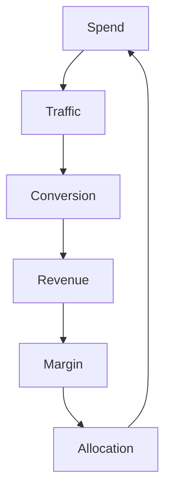

# 30 — Revenue, Attribution & Unit Economics

**Status:** Target architecture.

## 1. Economic model

CAT ultimately exists to create measurable economic value while remaining policy-compliant and operationally sustainable.

## 2. Value chain



## 3. Attribution

Attribution should preserve the chain between:

```text
source opportunity
→ content asset
→ channel/campaign
→ visitor/session
→ click
→ conversion
→ commission
```

Where attribution is uncertain, CAT should represent uncertainty rather than manufacture precision.

## 4. Unit economics

Useful target metrics include:

| Metric | Meaning |
|---|---|
| Revenue per click | realized revenue / qualified clicks |
| EPC | earnings per click |
| Conversion rate | conversions / eligible traffic |
| CAC | acquisition cost per customer/conversion where applicable |
| Content ROI | attributable contribution / content cost |
| Campaign ROI | contribution / campaign spend |
| Agent cost | compute/provider cost per useful outcome |
| Contribution margin | revenue minus variable costs |

## 5. Cost allocation

AI costs should be attributable where practical:

```text
Model request
→ agent
→ capability
→ workflow
→ campaign/opportunity
→ business outcome
```

## 6. Expected versus realized

CAT must distinguish forecasts from realized economics:

```text
Expected commission ≠ earned commission
Expected conversion ≠ conversion
Reported commission ≠ reconciled commission
```

## 7. Optimization

Budget allocation should eventually maximize expected incremental contribution subject to risk, constraints, and diminishing returns.

## 8. Revenue integrity

Revenue records should have provenance and reconciliation state. Corrections from networks or merchants must be represented as adjustments rather than silently rewriting historical observations.

## 9. Treasury boundary

Financial settlement, withdrawals, taxes, banking, and regulated payment operations are higher-risk capabilities. They require stronger authorization and human controls than ordinary discovery or analysis.

## 10. Economic feedback loop



The system should learn from contribution, not vanity metrics.