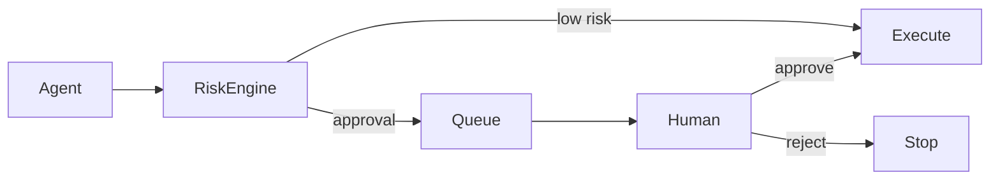

# 31 — Control Plane & Human Operations

**Status:** Target architecture.

## 1. Purpose

The control plane is the human-facing and machine-governance interface for understanding, configuring, approving, operating, and auditing CAT.

## 2. Operating surfaces

```text
Control Plane
├── Overview / health
├── Agents
├── Workflows
├── Opportunities
├── Content
├── Campaigns
├── Providers
├── Policies
├── Approvals
├── Experiments
├── Revenue
├── Costs
├── Knowledge
├── Audit
└── System configuration
```

## 3. Dashboard philosophy

The UI should expose decisions and consequences rather than merely raw infrastructure metrics.

## 4. Approval center



An approval is a governed decision with identity, timestamp, scope, expiration where appropriate, and audit evidence.

## 5. Configuration

Configuration must distinguish:

- safe runtime preferences;
- business parameters;
- provider configuration;
- security settings;
- policy settings;
- experimental settings.

Sensitive configuration should never be displayed unnecessarily.

## 6. Explainability

For consequential decisions the control plane should answer:

- What did CAT choose?
- What alternatives existed?
- What evidence supported the choice?
- What policy permitted it?
- What is expected to happen?
- What actually happened?

## 7. Emergency controls

The operator should be able to disable selected capabilities/providers/campaigns and, where architecturally supported, stop new work without corrupting in-flight durable state.

## 8. Human role

Humans are not expected to micromanage every low-risk action. Their role is to define policy, supervise exceptions, approve high-impact operations, and periodically review system behavior.

## 9. Audit UX

Audit history should be append-oriented and searchable by actor, workflow, capability, target, policy, correlation ID, time range, and outcome.

## 10. Accessibility and ergonomics

The control plane should support responsive layouts, keyboard navigation, clear status semantics, readable dense data, explicit destructive-action confirmation, and progressive disclosure for advanced controls.

## 11. UI security

The UI is not a security boundary by itself. Every sensitive operation must be authorized server-side regardless of what the interface displays or hides.