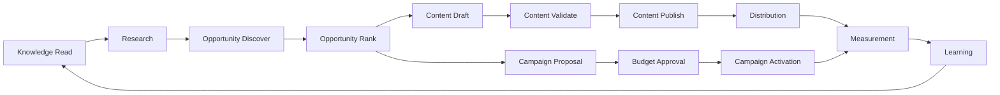

# 33 — Agent Capability Matrix

**Status:** Architecture specification / target-state catalog. This document defines the capability boundaries that agents may request; it does not claim that every listed capability is currently implemented.

## 1. Canonical model

`Agent → Capability → Domain Service → Provider/Connector → External System`

A **capability** is a governed, versioned permission to perform a business or platform operation. A tool is merely one execution mechanism. An agent never receives unrestricted access merely because a tool exists.

## 2. Capability classes

| Class | Examples | Typical risk |
|---|---|---|
| Observe | read metrics, inspect opportunity, retrieve knowledge | Low |
| Analyze | rank offers, evaluate evidence, forecast | Low–Medium |
| Generate | draft content, create campaign proposal | Medium |
| Mutate | update records, publish content, change workflow | Medium–High |
| External Action | call network, publish ad, send notification | High |
| Economic | spend budget, alter treasury state, reconcile revenue | Critical |
| Governance | approve, revoke, change policy | Critical |
| Security | rotate credential, quarantine agent | Critical |

## 3. Core capability matrix

| Capability | Primary agents | Read/Write | Approval | Evidence required |
|---|---|---|---|---|
| `knowledge.read` | Research, Strategy, Specialist | R | No | provenance |
| `knowledge.propose` | Research, Curator | W | Usually | sources + confidence |
| `knowledge.promote` | Knowledge Curator | W | Policy-dependent | validation record |
| `opportunity.discover` | Product Hunter, Market Scout | W | No | source observation |
| `opportunity.rank` | Opportunity Ranker | W projection | No | scoring inputs |
| `affiliate.program.evaluate` | Program Analyst | W | No | program evidence |
| `affiliate.link.create` | Link Builder | W | Policy | destination + attribution |
| `content.draft` | Copywriter, Reviewer | W | No | brief + sources |
| `content.validate` | Editor, Compliance | W | No | validation report |
| `content.publish` | Publisher | W | Policy | approved artifact |
| `distribution.plan` | Growth, Distribution | W | No | audience/economic model |
| `campaign.propose` | Acquisition Strategist | W | Yes for spend | forecast |
| `campaign.activate` | Campaign Builder | W | Yes | approved plan |
| `budget.allocate` | Resource/Budget Manager | W | Yes above threshold | economic rationale |
| `workflow.execute` | Orchestrator-facing agents | W | Policy | workflow ID |
| `provider.invoke` | Provider adapters | W | Capability policy | provider result |
| `incident.create` | Monitor/Incident Agent | W | No | telemetry/evidence |
| `agent.quarantine` | Security/Risk Governor | W | Critical policy | incident + reason |
| `policy.propose` | Governance agents | W | Always | rationale + diff |
| `policy.activate` | Governance control plane | W | Human/policy gate | signed decision |
| `revenue.reconcile` | Revenue Analyst | W | Policy | source statements |
| `treasury.transfer` | Treasury subsystem | W | Strong gate | authorization + ledger |

## 4. Capability dependency graph

## 5. Authorization rule

The effective permission is the intersection of:

`Agent Identity × Capability × Resource Scope × Policy × Environment × Budget × Approval State`

A capability request must be rejected if any mandatory dimension is missing or stale.

## 6. Capability versioning

Capabilities use semantic versions and compatibility rules:

- breaking contract change → major version;
- backward-compatible extension → minor version;
- clarification/bug fix → patch version;
- deprecated versions remain readable for an explicit migration window;
- external providers are never allowed to silently redefine CAT capability semantics.

## 7. Financial capability controls

Economic capabilities require additional controls:

1. maximum amount per action;
2. cumulative period budget;
3. currency and account scope;
4. beneficiary/resource scope;
5. approval threshold;
6. idempotency key;
7. reconciliation requirement;
8. immutable audit evidence.

## 8. Deny-by-default

Unknown capability, unknown scope, expired authorization, missing evidence, exceeded budget, unsafe provider state, or policy conflict results in **deny**, not best-effort execution.

## 9. AI implementation guidance

AI agents should reason over capability identifiers and typed contracts, not infer permissions from natural-language instructions. Tool descriptions are untrusted metadata until admitted by the capability/policy layer.
