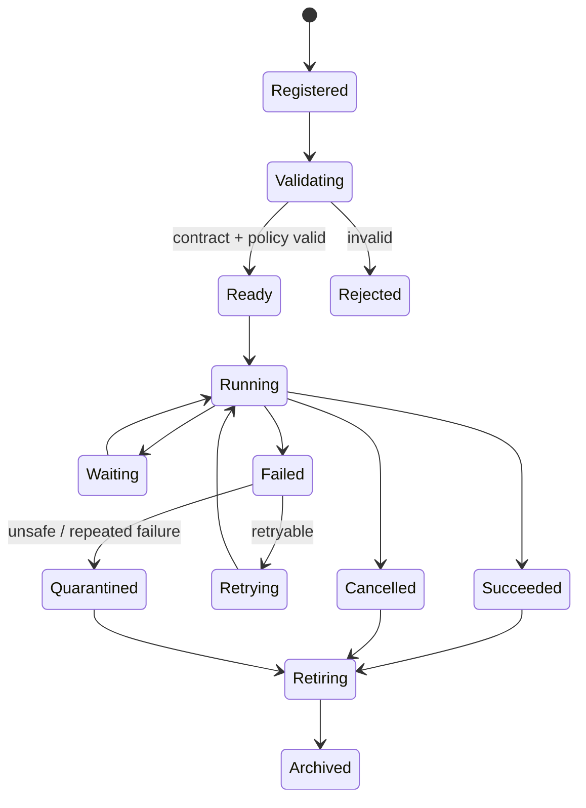

# 34 — Agent Lifecycle, Health & Operations

**Status:** Architecture specification / target-state.

## 1. Lifecycle

## 2. Registration gate

An agent is not runnable until CAT can verify:

- stable agent ID and version;
- declared purpose and owner;
- capability manifest;
- policy binding;
- model/provider policy;
- input/output contracts;
- memory scopes;
- resource budget;
- observability hooks;
- evaluation suite;
- emergency behavior.

## 3. Health dimensions

| Dimension | Signals |
|---|---|
| Availability | heartbeat, successful task rate |
| Correctness | evaluation score, validation failures |
| Reliability | retry rate, timeout rate, duplicate rate |
| Economics | cost/task, budget variance |
| Safety | policy denials, incidents, unsafe outputs |
| Freshness | stale knowledge/provider data |
| Latency | p50/p95/p99 execution time |
| Drift | performance change versus baseline |

## 4. Health state

`HEALTHY → DEGRADED → UNHEALTHY → QUARANTINED`

Recovery is explicit. A quarantined agent must not automatically regain high-risk permissions solely because its process restarted.

## 5. Failure taxonomy

- **Transient:** retry with bounded backoff.
- **Dependency:** provider/database unavailable; wait or route around.
- **Contract:** invalid input/output; stop and surface.
- **Policy:** unauthorized action; deny without blind retry.
- **Economic:** budget exceeded; stop and escalate.
- **Safety:** suspicious instruction/output; quarantine where policy requires.
- **Data:** stale/conflicting evidence; invalidate or revalidate.
- **Systemic:** repeated correlated failures; create incident and reduce blast radius.

## 6. Operational SLOs

Every production agent should have explicit targets for availability, latency, correctness, cost and safety. SLOs are domain-specific; this Bible intentionally does not invent universal numerical thresholds.

## 7. Quarantine triggers

Examples include:

- repeated policy violations;
- anomalous external calls;
- unexplained financial actions;
- repeated contract violations;
- credential misuse indicators;
- severe evaluation regression;
- runaway cost or recursion.

## 8. Restart safety

Restarting an agent must not duplicate durable side effects. Workflows use durable IDs, idempotency keys, inbox/outbox controls, and reconciliation where external state is uncertain.

## 9. Operator controls

The control plane should expose: pause, resume, drain, cancel, quarantine, retry, replay, inspect evidence, inspect cost, rotate provider, and compare versions. High-impact controls require appropriate authorization and audit records.
