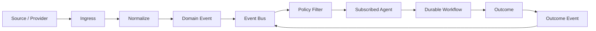

# 35 — Agent Triggers & Event Matrix

**Status:** Architecture specification / target-state.

## 1. Principle

Agents should be activated by explicit goals, schedules, commands, or domain events. Event subscription is not authorization to mutate the event source.

## 2. Canonical event flow

## 3. Trigger matrix

| Event / trigger | Candidate agents | Expected action | Durability |
|---|---|---|---|
| `goal.created` | Executive, Strategy | create objective decomposition | durable |
| `workflow.scheduled` | Mission Planner, Orchestrator | start workflow | durable |
| `market.signal.detected` | Trend Hunter, Market Scout | research and score signal | durable |
| `opportunity.discovered` | Program Analyst, Ranker | evaluate opportunity | durable |
| `opportunity.stale` | Revalidation Agent | refresh evidence | durable |
| `content.brief.created` | Researcher, Copywriter | produce artifact | durable |
| `content.validation.failed` | Editor, Researcher | revise or escalate | durable |
| `content.approved` | Publisher | publish according to policy | durable |
| `conversion.recorded` | Attribution, Revenue Analyst | attribute and update projections | durable |
| `revenue.statement.received` | Reconciliation Agent | reconcile | durable |
| `provider.degraded` | Provider Health, Resource Manager | reroute / reduce traffic | durable |
| `budget.threshold.reached` | Resource Manager, Risk Governor | constrain execution | durable |
| `security.anomaly.detected` | Security Monitor, Risk Governor | investigate / quarantine | durable |
| `agent.evaluation.regressed` | Evaluation Director | gate rollout | durable |
| `deployment.completed` | Health Monitor | verify release | durable |
| `backup.failed` | Recovery Agent, Incident Agent | retry/escalate | durable |

## 4. Event handling contract

Every event consumer should record:

- event ID;
- consumer ID/version;
- received timestamp;
- processing attempt;
- correlation/causation IDs;
- outcome;
- retry classification;
- emitted follow-up events.

## 5. At-least-once assumption

Consumers must tolerate duplicate delivery. Handlers should be idempotent where possible; otherwise they must use durable deduplication and transactional boundaries.

## 6. Event vs command

**Command:** asks CAT to perform an action and has an intended owner.

**Event:** states that something happened and may have many consumers.

An agent must not treat an event as an implicit command unless an explicit policy maps that event to an authorized action.

## 7. Storm protection

The event plane should support deduplication, rate limits, partitioning, backpressure, circuit breakers, dead-letter handling and loop detection. Agent-generated events must not create uncontrolled self-triggering cycles.
