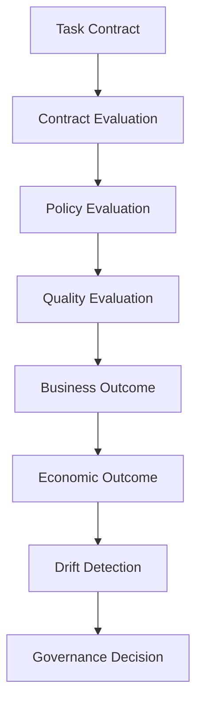
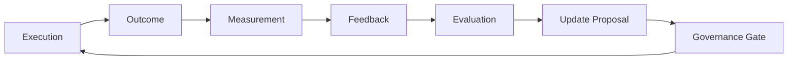

# 36 — Agent Evaluation, KPI & Quality Model

**Status:** Architecture specification / target-state.

## 1. Evaluation principle

An agent is not considered successful merely because it returned a response. CAT evaluates whether the response satisfied its contract, policy, business objective, economic constraints and evidence requirements.

## 2. Evaluation layers

## 3. KPI families

| Family | Example metrics |
|---|---|
| Correctness | task success, factual accuracy, validation pass rate |
| Reliability | retries, timeouts, duplicate effects |
| Efficiency | cost/task, tokens/task, compute/task |
| Latency | p50/p95/p99 |
| Safety | policy violations, unsafe action attempts |
| Business | conversion quality, revenue contribution, margin contribution |
| Learning | improvement after feedback, regression rate |
| Collaboration | delegation success, handoff quality |

No single score should replace the underlying metrics.

## 4. Evaluation record

A durable evaluation record should contain:

- subject agent/version;
- task/workflow ID;
- evaluation suite/version;
- inputs and references;
- expected behavior or rubric;
- observed outcome;
- evaluator type;
- score(s);
- confidence;
- cost/latency;
- policy result;
- evidence references;
- regression classification.

## 5. Evaluation methods

1. **Deterministic tests** — schemas, invariants, arithmetic, state transitions.
2. **Reference tests** — compare against curated expected outcomes.
3. **Model-based evaluation** — rubric-driven qualitative assessment with explicit evaluator version.
4. **Human review** — high-risk or ambiguous cases.
5. **Online business evaluation** — realized outcomes after deployment.
6. **Shadow evaluation** — evaluate a candidate without granting production side effects.

## 6. Promotion gates

A candidate agent/model/provider should pass all applicable gates:

`contract → safety → quality → economics → reliability → domain KPI → human approval (when required)`

A high aggregate score cannot compensate for a critical safety or policy failure.

## 7. Drift

Drift may occur in models, providers, markets, audience behavior, source quality, content distribution, or economics. CAT should compare current performance with a declared baseline and classify material changes before automatic promotion.

## 8. Feedback loop

## 9. Anti-gaming controls

Agents and evaluators must not optimize solely for a visible score. Use multiple metrics, holdout cases, adversarial cases, business outcomes, human review and periodic evaluator audits.
