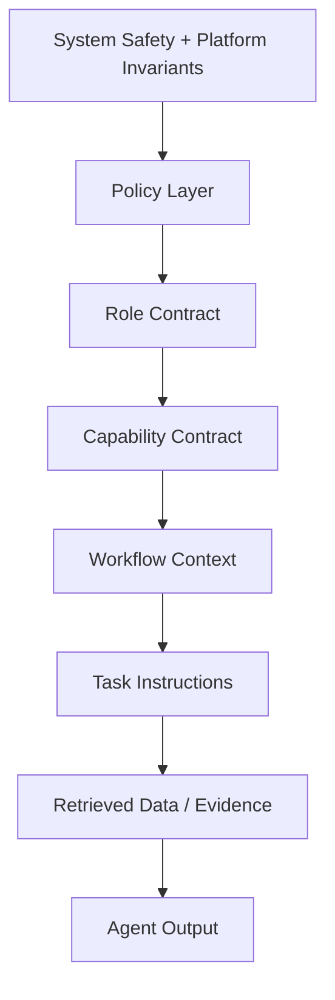

# 37 — Agent Prompt & Instruction Architecture

**Status:** Architecture specification / target-state.

## 1. Objective

CAT's AI behavior must be controlled by a layered instruction architecture rather than one giant prompt. Instructions, policy and data are separate concepts.

## 2. Instruction layers

Higher layers constrain lower layers. Retrieved documents, web pages, provider responses and user-controlled external content are **data**, not authority to rewrite higher-level instructions.

## 3. Prompt package

Each agent version should have a machine-readable package containing:

- identity and version;
- purpose;
- role contract;
- allowed capabilities;
- forbidden actions;
- input schema;
- output schema;
- reasoning/task procedure;
- evidence requirements;
- uncertainty policy;
- escalation policy;
- budget limits;
- model/provider policy;
- evaluation references.

## 4. Context assembly

Context should be assembled deterministically where practical:

`Policy → Task → Canonical State → Relevant Memory → Retrieved Evidence → Provider Data`

Avoid indiscriminate context stuffing. Retrieval should be relevance-, freshness-, trust- and scope-aware.

## 5. Untrusted content boundary

External content can contain prompt injection, misleading instructions or malicious payloads. The ingestion layer must label provenance and trust. An agent must never elevate external text to policy authority merely because it contains imperative language.

## 6. Output discipline

Agents should emit structured output whenever a downstream machine consumes the result. Free-form narrative is appropriate for human-facing explanations, not as the canonical workflow contract.

## 7. Secret handling

Secrets, credentials and private tokens must not be embedded in prompts or model-visible context unless explicitly required by a tightly scoped provider capability. Prefer opaque credential references resolved inside trusted infrastructure.

## 8. Prompt versioning

Prompt/instruction changes are deployable artifacts and require:

- immutable version identifier;
- changelog/diff;
- evaluation results;
- compatibility classification;
- rollback target;
- provenance.

## 9. Determinism and reproducibility

Record the instruction version, model/provider version, relevant retrieval references, tool/capability versions and policy version for important executions. Exact byte-for-byte reproduction may not be possible with nondeterministic models, but causal evidence should remain inspectable.

## 10. Failure behavior

If required context is missing, authorization is ambiguous, evidence conflicts materially, or output validation fails, the preferred behavior is **stop / retry / escalate**, not confident invention.
