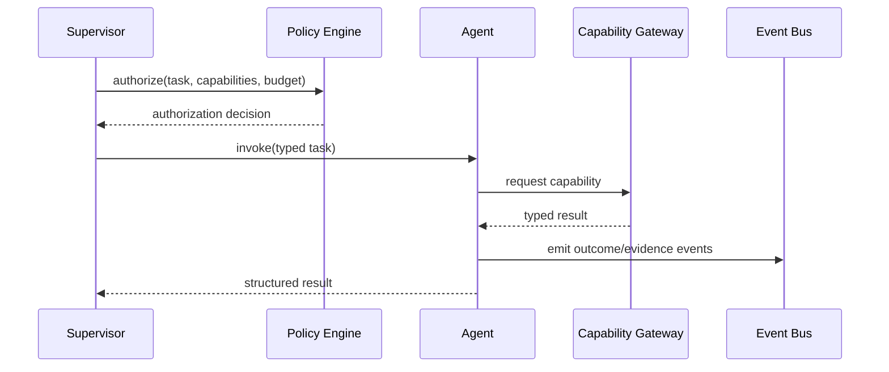

# 39 — Agent Contracts & Domain Specifications

**Status:** Architecture specification. This document defines canonical contracts for CAT agents; executable implementations remain authoritative.

## 1. Purpose

Every production agent must have a deterministic boundary between intent, authorization, execution, evidence, and outcome. The contract is the compatibility surface between the agent runtime and the rest of CAT.

## 2. Canonical agent contract

```text
AgentContract
├── identity
│   ├── agent_id
│   ├── version
│   ├── owner
│   └── domain
├── purpose
├── capabilities[]
├── input_schema
├── output_schema
├── policy_requirements
├── context_requirements
├── memory_scope
├── budget_policy
├── model_policy
├── side_effect_policy
├── retry_policy
├── observability
├── evaluation_policy
└── lifecycle_policy
```

## 3. Invocation contract



An invocation must be traceable by `execution_id`, `task_id`, `agent_id`, `contract_version`, and correlation identifiers.

## 4. Outcome contract

Every completed execution returns:

| Field | Meaning |
|---|---|
| status | succeeded, partial, rejected, failed, cancelled |
| output | Typed domain result |
| evidence | References supporting the result |
| confidence | Explicit uncertainty when applicable |
| policy | Policy decisions and gates encountered |
| usage | Model, compute, network and financial usage |
| events | Domain events emitted |
| errors | Structured, classified failures |
| provenance | Origin and transformation lineage |

## 5. Side-effect classes

| Class | Example | Default |
|---|---|---|
| S0 | Read-only retrieval | Allowed by capability |
| S1 | Internal state mutation | Authorized |
| S2 | External non-financial mutation | Additional policy gate |
| S3 | Financial / irreversible action | Explicit authorization + reconciliation |

Agents must never infer permission from task text alone.

## 6. Failure contract

Failures are classified before retry:

- transient;
- rate-limited;
- dependency unavailable;
- validation failure;
- authorization denied;
- policy denied;
- deterministic application error;
- ambiguous external outcome;
- permanent business rejection.

Ambiguous external outcomes must enter reconciliation rather than being blindly retried.

## 7. Versioning

Contracts are immutable once published. Breaking changes require a new major contract version or an explicit migration mechanism. Event schemas use additive evolution where possible.

## 8. Domain specification template

Each concrete agent specification should contain:

1. mission;
2. non-goals;
3. required capabilities;
4. accepted inputs;
5. produced outputs;
6. authoritative data sources;
7. memory read/write boundaries;
8. policy gates;
9. side effects;
10. failure semantics;
11. SLO/KPI;
12. evaluation suite;
13. security boundary;
14. cost budget;
15. observability requirements;
16. escalation conditions.

## 9. Example: Opportunity Ranker

```text
Mission: rank affiliate opportunities using evidence-backed economic and strategic criteria.
Non-goals: activate programs, publish content, or spend advertising budget.
Reads: normalized opportunities, merchant observations, audience signals, economics.
Writes: ranking decisions and evidence records.
Side effects: S1 only.
Escalation: conflicting evidence, policy uncertainty, insufficient data.
```

## 10. Contract invariants

- Typed input/output over free-form internal assumptions.
- Authorization is evaluated before privileged capability execution.
- Evidence is retained for material decisions.
- Side effects are idempotent or reconciled.
- Costs are observable.
- Uncertainty is represented rather than hidden.
- Agents cannot silently expand their capability set.
- Policy is outside the agent's self-declared authority.
