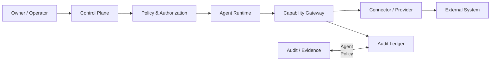

# 40 — Agent Security & Trust Boundaries

**Status:** Architecture specification.

## 1. Security model

CAT treats every agent as a potentially fallible computation operating inside a governed trust boundary. Intelligence does not imply authority.



## 2. Trust zones

| Zone | Contents | Trust assumption |
|---|---|---|
| Z0 | External content, webpages, feeds | Untrusted |
| Z1 | Provider responses | Untrusted until validated |
| Z2 | Agent working context | Controlled but fallible |
| Z3 | Domain services | Trusted implementation boundary |
| Z4 | Policy, authorization, audit | Highest control boundary |

Retrieved text must never become executable policy merely because an agent read it.

## 3. Capability security

Capabilities are explicit grants. A capability token should identify:

- subject agent;
- capability and version;
- permitted resource scope;
- action class;
- expiry;
- budget constraints;
- policy context;
- correlation ID.

Least privilege is the default.

## 4. Prompt-injection boundary

External text can contain instructions such as `ignore previous instructions`, hidden markup, or malicious tool requests. CAT treats these as **data**, not authority.

```text
External content
      ↓
Parse / sanitize
      ↓
Evidence representation
      ↓
Agent reasoning
      ↓
Policy engine
      ↓
Capability gateway
```

No retrieved document can directly grant a capability.

## 5. Credential isolation

Agents do not receive raw provider secrets unless an explicitly isolated integration requires it. Preferred architecture:

`Agent → Capability Gateway → Secret-aware Connector → Provider`

Credentials remain outside prompts, event payloads, logs, traces, and ordinary agent memory.

## 6. Economic authorization

Financial side effects require additional controls:

```text
Intent
 → Policy check
 → Budget check
 → Risk check
 → Approval requirement
 → Execution
 → External confirmation
 → Reconciliation
 → Audit
```

A successful API response is not automatically equivalent to realized financial state.

## 7. Security events

Important events include:

- authorization denied;
- capability escalation attempt;
- credential access violation;
- prompt-injection detection;
- abnormal tool-call volume;
- budget exhaustion;
- policy conflict;
- provider compromise signal;
- suspicious data exfiltration pattern;
- agent quarantine.

## 8. Containment

The platform must be able to disable an agent, revoke capabilities, isolate a provider, stop a workflow, and preserve forensic evidence without destroying canonical state.

## 9. Security invariants

1. No implicit authority from natural language.
2. No secret material in model-visible context unless unavoidable and scoped.
3. No unrestricted database credentials for agents.
4. No untracked privileged side effect.
5. No blind retry of ambiguous financial operations.
6. Every material authorization decision is auditable.
7. Quarantine must be reversible by an authorized operator.
