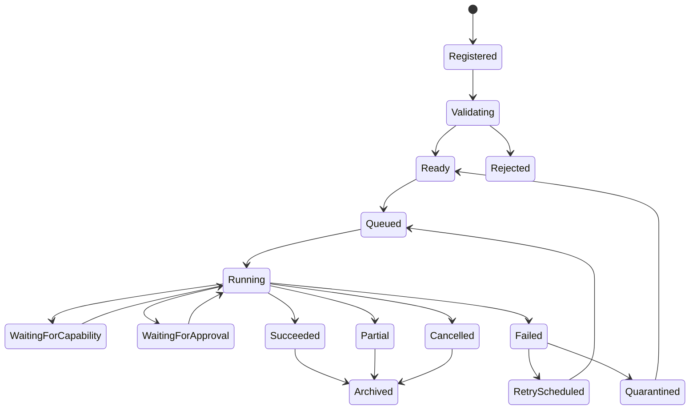

# 41 — Agent State Machine & Execution Model

**Status:** Architecture specification.

## 1. Execution model

CAT separates an agent's durable lifecycle state from an individual execution attempt. A restart must not erase the execution history.



## 2. State ownership

| State | Authority |
|---|---|
| Registered | Agent registry |
| Validating | Registration/validation service |
| Ready | Runtime + policy |
| Queued | Scheduler/orchestrator |
| Running | Execution runtime |
| WaitingForApproval | Governance/policy |
| Succeeded/Partial/Failed | Execution result |
| Quarantined | Security/operations authority |
| Archived | Lifecycle controller |

An agent cannot self-authorize a transition into a privileged state.

## 3. Execution attempt

Each attempt has:

`attempt_id + execution_id + started_at + ended_at + worker + contract_version + input_hash + outcome + usage + errors + evidence`.

Attempts are append-oriented records. Retrying creates a new attempt rather than overwriting the old one.

## 4. Determinism boundary

Where deterministic behavior is possible, CAT should record:

- input hash;
- policy version;
- prompt/instruction package version;
- model/provider identity;
- tool/capability versions;
- relevant configuration snapshot;
- random seed where supported.

This permits replay, evaluation, and forensic analysis without claiming that stochastic model execution is perfectly reproducible.

## 5. Concurrency

Every state mutation must use a concurrency boundary appropriate to its storage model. Distributed execution should use idempotency keys, leases/fencing, or equivalent ownership mechanisms.

## 6. Cancellation

Cancellation is a first-class outcome. The system should distinguish:

- cancellation requested;
- cancellation acknowledged;
- cancellation completed;
- cancellation timed out;
- external action requiring reconciliation.

## 7. Backpressure

When downstream capacity is constrained, CAT should prefer controlled queueing, admission limits, prioritization, or degradation over uncontrolled parallelism.

## 8. Crash recovery

On process loss:

```text
Persisted execution
      ↓
Recovery scan
      ↓
Classify unfinished attempts
      ↓
Resume / reconcile / retry / quarantine
      ↓
Emit recovery evidence
```

## 9. State-machine invariants

- Illegal transitions are rejected.
- Terminal states are immutable except through explicit administrative workflows.
- Every transition is attributable.
- Retries preserve lineage.
- Recovery never assumes that an external side effect did not happen merely because local state is incomplete.
