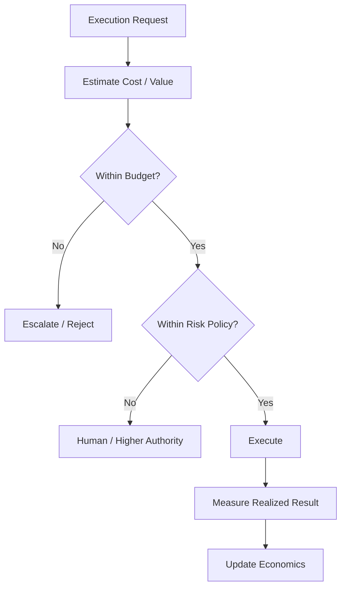

# 42 — Agent Economics & Resource Governance

**Status:** Architecture specification.

## 1. Principle

CAT agents consume scarce resources. Autonomy must therefore be bounded not only by policy but also by economics.

## 2. Resource classes

| Resource | Examples | Required accounting |
|---|---|---|
| Model | tokens, inference calls | provider/model/cost |
| Compute | CPU, memory, GPU time | execution/workflow |
| Network | requests, bandwidth | provider/connector |
| Storage | database, object, vector | domain/resource |
| Human | review/approval time | workflow/task |
| Financial | ad spend, purchases | budget/authorization |

## 3. Agent budget envelope

```text
BudgetEnvelope
├── max_execution_cost
├── max_daily_cost
├── max_concurrency
├── max_tool_calls
├── max_external_requests
├── max_duration
├── financial_limit
└── escalation_thresholds
```

Budgets are enforced outside the agent's reasoning loop.

## 4. Cost attribution

Every material execution should be attributable to:

`agent → mission → workflow → task → capability → provider → resource`.

This permits unit economics and optimization without guessing where spend originated.

## 5. Economic decision policy

A useful execution should not be evaluated solely on task success. CAT should consider:

```text
Expected Value
− Expected Cost
− Risk-adjusted Loss
= Economic Decision Signal
```

The formula is a decision-support abstraction; concrete domains define their own measurable models.

## 6. Adaptive resource allocation

The Resource Manager may change model/provider selection, concurrency, batching, caching, or scheduling within policy boundaries. Material financial changes require the appropriate authorization level.

## 7. Cost anomaly detection

Detect:

- sudden token/call growth;
- repeated retries;
- provider price changes;
- unexpected concurrency;
- low-value high-cost workflows;
- runaway loops;
- spend disconnected from realized outcomes.

## 8. Economic safety controls



## 9. Anti-runaway rules

- finite retry budgets;
- exponential/backoff policies where appropriate;
- maximum workflow duration;
- concurrency ceilings;
- circuit breakers;
- provider rate-limit awareness;
- quarantine on repeated abnormal behavior.

## 10. Governance invariant

An agent may optimize resource use **inside** its granted budget, but it cannot redefine its own budget, authorize itself to exceed it, or conceal resource consumption.
