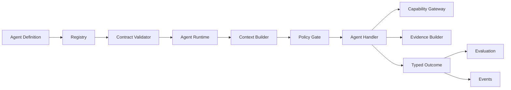

# 43 — CAT Agent SDK Reference Architecture

**Status:** Target architecture. This is the reference shape for future executable Agent SDK work.

## 1. SDK objective

The SDK should make the safe path the easiest path. An agent author should define identity, capabilities, schemas, policy requirements, handlers, and evaluation hooks without manually implementing cross-cutting concerns.

## 2. Reference package

```text
cat-agent-sdk/
├── identity
├── contracts
├── capabilities
├── context
├── policy
├── memory
├── execution
├── events
├── observability
├── evaluation
├── economics
└── testing
```

## 3. Runtime pipeline



## 4. Developer ergonomics

A future implementation should support a declarative pattern conceptually equivalent to:

```text
AgentDefinition
  identity(...)
  capabilities(...)
  input(schema)
  output(schema)
  policy(...)
  budget(...)
  handler(...)
  evaluation(...)
```

The exact programming API is intentionally deferred until the repository's implementation language boundaries and crate/service topology are finalized.

## 5. Testing model

SDK-provided test helpers should cover:

- schema validation;
- capability authorization;
- policy denial;
- idempotency;
- retry classification;
- event emission;
- budget enforcement;
- secret non-disclosure;
- prompt-injection resistance;
- deterministic fixtures;
- contract compatibility.

## 6. Middleware

Cross-cutting behavior belongs in runtime middleware rather than duplicated in agents:

```text
Tracing
 → Authentication / Identity
 → Authorization
 → Budget
 → Rate Limit
 → Context
 → Handler
 → Outcome Validation
 → Evidence
 → Metrics / Events
```

## 7. Compatibility

The SDK must not bind CAT to one model vendor, vector database, queue, or deployment topology. Provider-specific behavior belongs behind capability/provider contracts.

## 8. Production gate

An agent package should not become operational merely because it compiles. Minimum maturity requires contract validation, policy tests, failure tests, observability, evaluation coverage, and an explicit lifecycle state.
