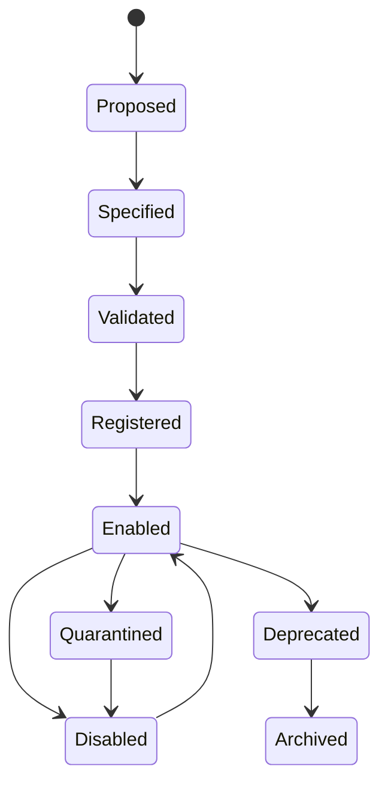
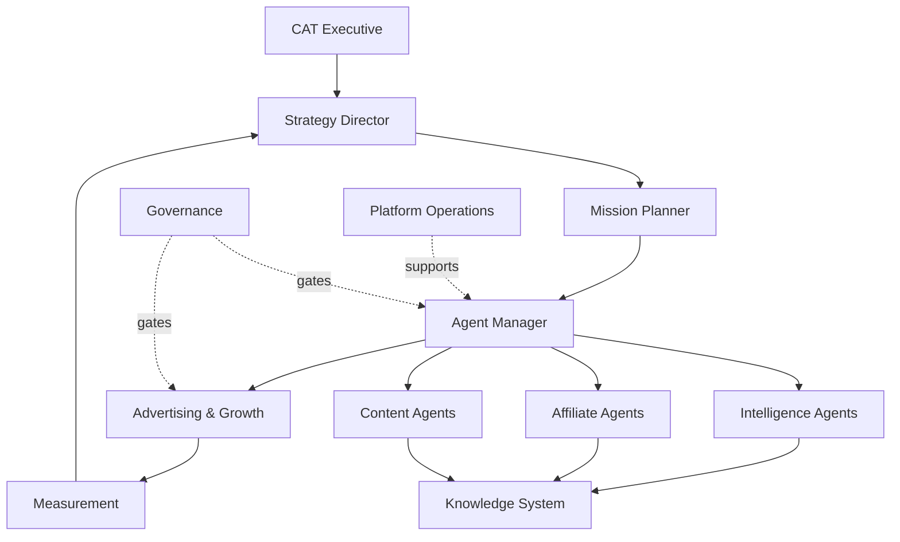

# 44 — CAT Agent Registry

**Status:** Target architecture / canonical registry specification.

## 1. Purpose

The Agent Registry is the authoritative catalog of agent identities, contracts, capabilities, lifecycle state, ownership, policies, and operational metadata. It is not merely a list of prompts.

## 2. Registry record

```text
AgentRecord
├── agent_id
├── canonical_name
├── version
├── domain
├── mission
├── owner
├── lifecycle_state
├── autonomy_level
├── risk_class
├── capabilities[]
├── required_events[]
├── emitted_events[]
├── input_contract
├── output_contract
├── memory_scopes[]
├── knowledge_scopes[]
├── tool_classes[]
├── policy_profile
├── budget_profile
├── model_policy
├── dependency_graph
├── evaluation_profile
├── slo_profile
├── security_profile
└── provenance
```

## 3. Canonical domains

| Domain | Representative agents |
|---|---|
| Executive | CAT Executive, Strategy Director |
| Governance | Risk Governor, Policy Analyst, Approval Coordinator |
| Intelligence | Researcher, Market Scout, Trend Hunter, Fact Checker |
| Affiliate | Product Hunter, Program Analyst, Offer Analyst, Opportunity Ranker |
| Content | Researcher, Writer, Editor, SEO, Localization |
| Distribution | Publisher, Channel Analyst, Growth Analyst |
| Advertising | Campaign Builder, Audience Analyst, Budget Optimizer |
| Measurement | Attribution Analyst, Revenue Analyst, Experiment Analyst |
| Platform | Scheduler, Workflow Monitor, Cost Monitor, Security Monitor |
| Knowledge | Knowledge Curator, Memory Manager, Graph Maintainer |
| Operations | Incident Agent, Recovery Agent, Release Agent |

## 4. Registry status model



A registry entry may exist before implementation. `Registered` does not mean `Implemented`.

## 5. Autonomy and risk

Autonomy and risk are independent dimensions.

| Autonomy | Meaning |
|---|---|
| A0 | Observe / report only |
| A1 | Recommend |
| A2 | Execute reversible low-risk actions |
| A3 | Execute bounded consequential workflows |
| A4 | Coordinate broad autonomous workflows within policy |
| A5 | Reserved for future governed system-level autonomy |

Risk classes should be domain-defined, but financial, identity, security, irreversible, and high-impact actions require stronger policy gates.

## 6. Registry validation gates

Before enabling an agent:

1. identity is unique;
2. contract schemas validate;
3. capabilities exist and are version-compatible;
4. policy profile exists;
5. budget profile exists;
6. memory boundaries are explicit;
7. security profile exists;
8. evaluation suite exists;
9. observability is configured;
10. lifecycle owner exists.

## 7. Dependency graph



## 8. Registry invariants

- One canonical ID per logical agent.
- Versions are explicit.
- Capabilities are referenced by contract, never by hidden prompt convention.
- Registry state is auditable.
- Disabled/quarantined agents cannot receive new privileged work.
- Dependency cycles require explicit detection and policy handling.
- Registry metadata cannot grant authority by itself; authorization remains a separate control.
