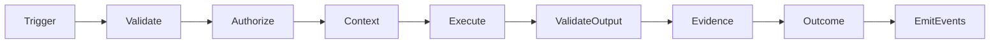

# 45 — CAT Agent Specification Template

**Status:** Canonical documentation template.

This template is the required format for future concrete agent specifications. It is intentionally machine-readable in structure while remaining useful to human operators.

## 1. Identity

```yaml
agent_id: cat.<domain>.<name>
name: <canonical name>
version: 1.0.0
domain: <domain>
ownership: <team or system owner>
status: proposed
```

## 2. Mission

**Purpose:**

> One precise statement of the business/system outcome this agent exists to produce.

**Non-goals:**

- capability outside mission boundary;
- policy ownership;
- unrestricted system administration;
- implicit authority over other agents.

## 3. Inputs

| Input | Type | Required | Trust | Source |
|---|---|---:|---|---|
| Task | Typed task | Yes | Controlled | Orchestrator |
| Context | Context bundle | Domain-defined | Mixed | Context service |
| Evidence | Evidence refs | Domain-defined | Provenance-scored | Knowledge system |

## 4. Outputs

The agent must return a typed result with status, output, evidence, confidence where applicable, usage, errors, and provenance.

## 5. Capabilities

```yaml
required_capabilities:
  - <capability.name@version>
optional_capabilities:
  - <capability.name@version>
```

For every capability document:

- permission scope;
- side-effect class;
- input/output schema;
- policy requirements;
- timeout;
- retry semantics;
- audit requirements.

## 6. Memory and knowledge

```text
Read:
  - <scope>
Write:
  - <scope>
Forbidden:
  - <scope>
```

Memory writes must state why the information deserves persistence and what provenance is attached.

## 7. Policy

Define:

- authorization requirements;
- autonomy level;
- risk class;
- approval requirements;
- data-handling constraints;
- geographic/compliance constraints where applicable;
- financial limits.

## 8. Model policy

Model selection is policy-controlled. Specify:

- supported model classes;
- minimum quality requirements;
- maximum cost;
- latency target;
- fallback policy;
- provider independence requirements.

## 9. Execution



## 10. Failure modes

For every dependency and operation document:

| Failure | Classification | Retry | Escalate | Recovery |
|---|---|---|---|---|
| Timeout | transient | bounded | after threshold | retry/backoff |
| Auth denial | permanent/policy | no | yes | policy review |
| Ambiguous external result | ambiguous | reconcile | yes | reconciliation |
| Invalid output | validation | bounded | after threshold | regenerate/fail |

## 11. Evaluation

Specify:

- offline test suite;
- golden cases;
- adversarial cases;
- policy tests;
- quality metrics;
- cost metrics;
- production monitoring;
- promotion criteria;
- rollback criteria.

## 12. Observability

Minimum identifiers:

`trace_id`, `correlation_id`, `task_id`, `execution_id`, `attempt_id`, `agent_id`, `contract_version`.

Record latency, outcome, resource usage, capability calls, policy decisions, and material errors.

## 13. Security

Document trust boundary, secret handling, external-input treatment, allowed capabilities, data classification, and quarantine triggers.

## 14. Economics

Define expected cost per execution, budget ceiling, resource classes, and the business metric that determines whether the agent creates useful value.

## 15. Human escalation

Specify exactly when the agent must stop and request human review. Human escalation is a controlled state, not an exception hidden inside a prompt.

## 16. Acceptance checklist

- [ ] Identity registered
- [ ] Contract versioned
- [ ] Capabilities authorized
- [ ] Policy defined
- [ ] Budget defined
- [ ] Memory boundaries defined
- [ ] Security review complete
- [ ] Evaluation suite complete
- [ ] Observability complete
- [ ] Failure/recovery behavior tested
- [ ] Lifecycle owner assigned
- [ ] Operational runbook available
