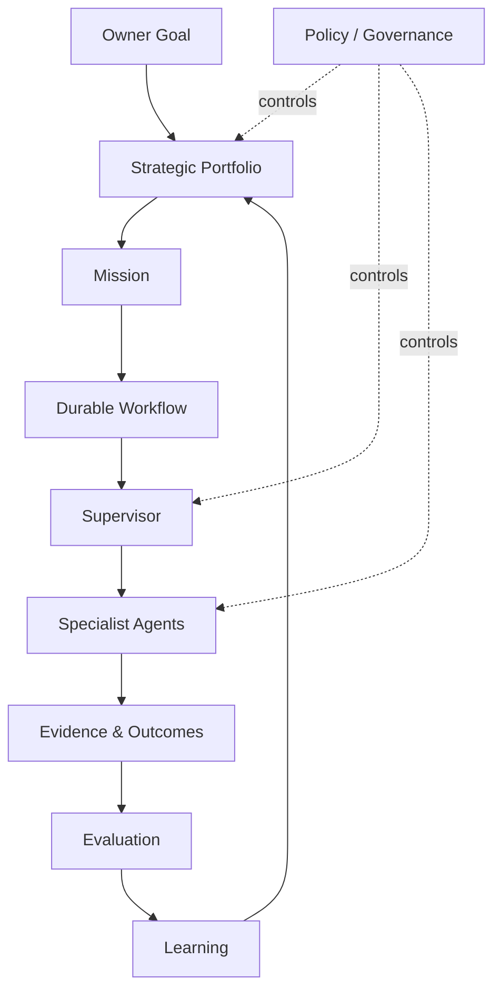

# 46 — CAT Agent Operating Model

**Status:** Target operating model.

## 1. Operating principle

CAT is operated as a governed network of specialized agents, not as a collection of independent chatbots. Each agent has a bounded mission and participates in a durable workflow.



## 2. Work hierarchy

```text
Goal
 └── Objective
      └── Mission
           └── Workflow
                └── Task
                     └── Execution
                          └── Attempt
```

Each level has a distinct purpose. A task is not a mission; an execution attempt is not the canonical business result.

## 3. Agent roles

### Executive agents
Translate owner objectives into measurable portfolios.

### Supervisory agents
Decompose work, delegate, coordinate, enforce boundaries, and aggregate typed outcomes.

### Specialist agents
Perform bounded domain work such as research, affiliate analysis, content production, measurement, or operations.

### Governance agents
Apply risk, compliance, policy, approval, and audit rules. They do not inherit authority from the agents they supervise.

### Platform agents
Maintain operational health, scheduling, recovery, security signals, and infrastructure workflows.

## 4. Daily operating loop

```text
Observe
 → Detect opportunities/problems
 → Prioritize
 → Plan
 → Authorize
 → Execute
 → Measure
 → Evaluate
 → Learn
 → Re-plan
```

## 5. Delegation rules

A supervisor delegates only the minimum capability set required for the task. Delegation must specify:

- objective;
- input references;
- expected artifact;
- deadline/SLO;
- budget;
- permitted capabilities;
- policy constraints;
- escalation conditions;
- acceptance criteria.

## 6. Communication rules

Agents communicate through typed task/artifact contracts and domain events. Raw transcript sharing is not the canonical integration mechanism.

## 7. Artifact-first collaboration

Preferred collaboration:

`Agent A → Typed Artifact → Agent B`

rather than:

`Agent A → Unbounded Conversation → Agent B`.

Artifacts improve provenance, validation, caching, replay, evaluation, and model independence.

## 8. Human operating modes

| Mode | Human role |
|---|---|
| Observe | Monitor outcomes |
| Approve | Authorize gated actions |
| Correct | Modify policy/configuration |
| Investigate | Review incidents/evidence |
| Override | Stop or redirect bounded workflows |
| Govern | Change strategic/system boundaries |

## 9. Operational dashboards

The control plane should expose:

- active missions;
- running agents;
- queued tasks;
- failures and retries;
- capability utilization;
- provider health;
- cost and budget;
- policy denials;
- approvals waiting;
- business outcomes;
- evaluation/drift signals.

## 10. Operating invariants

1. No agent is a hidden administrator.
2. No workflow depends on an ephemeral in-memory conversation for durability.
3. Every material side effect is attributable.
4. Every privileged action has an authorization path.
5. Failure is observable and classified.
6. Learning cannot silently rewrite policy.
7. Strategic objectives remain outside specialist-agent authority.
