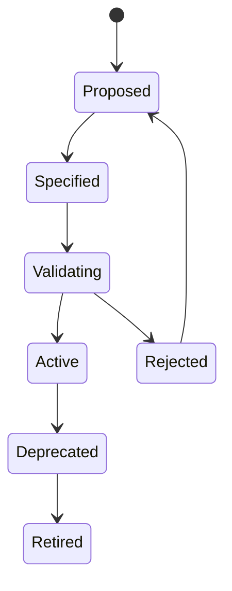
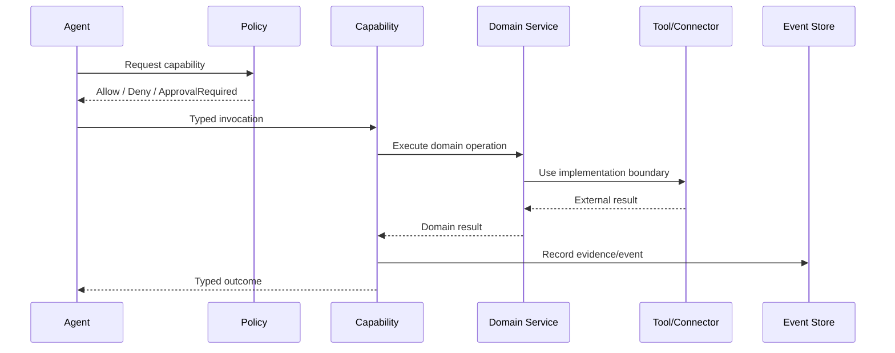

# CAT Capability Registry

**Status:** L2 — Architecture specified  
**Scope:** Canonical capability taxonomy and contract registry for CAT OMNISYSTEM  
**Audience:** Architects, developers, AI agents, operators, security reviewers

## 1. Purpose

A **capability** is a durable business or platform ability that CAT authorizes an agent or workflow to invoke through a stable contract. A capability is not a tool, provider, model, or implementation detail.

Canonical relationship:

```text
AGENT
  ↓ invokes
CAPABILITY
  ↓ implemented by
DOMAIN SERVICE
  ↓ may use
TOOL
  ↓ accessed through
CONNECTOR
  ↓ supplied by
PROVIDER
  ↓ reaches
EXTERNAL SYSTEM
```

This registry prevents capability semantics from becoming coupled to a particular vendor or execution mechanism.

## 2. Capability identity

Every capability receives a stable identifier:

```text
cat.capability.<domain>.<name>.v<major>
```

Examples:

```text
cat.capability.affiliate.discover.v1
cat.capability.content.generate.v1
cat.capability.measurement.attribute.v1
cat.capability.knowledge.retrieve.v1
```

A capability identifier is immutable after publication. Breaking changes require a new major contract.

## 3. Capability contract

Each registered capability MUST define:

| Field | Requirement |
|---|---|
| ID | Stable globally unique identifier |
| Version | Semantic contract version |
| Domain | Owning business/platform domain |
| Purpose | Single clear responsibility |
| Inputs | Typed input contract |
| Outputs | Typed output contract |
| Preconditions | Required state and permissions |
| Postconditions | Guaranteed state/effects |
| Side effects | S0–S3 classification |
| Required policy | Authorization and governance rules |
| Dependencies | Other capabilities/services |
| Evidence | Required provenance/audit information |
| Failure model | Typed retryable/non-retryable outcomes |
| Idempotency | Required behavior for duplicate requests |
| Observability | Metrics, traces and events |
| Evaluation | Quality and business KPIs |
| Economics | Resource and monetary budget dimensions |

## 4. Canonical capability domains

| Domain | Representative capabilities |
|---|---|
| Executive | goal management, prioritization, portfolio coordination |
| Governance | policy evaluation, approval, audit, emergency control |
| Intelligence | research, extraction, classification, forecasting |
| Knowledge | retrieval, graph traversal, provenance, memory operations |
| Affiliate | discovery, normalization, ranking, activation, tracking, reconciliation |
| Content | research brief, drafting, validation, localization, publishing |
| Distribution | channel selection, scheduling, syndication, experimentation |
| Advertising | campaign planning, launch, pacing, optimization, safety |
| Measurement | attribution, KPI calculation, experiment analysis |
| Platform | scheduling, orchestration, identity, configuration, notifications |
| Operations | health, incident response, recovery, capacity and cost control |

## 5. Capability invariants

1. A capability has one semantic purpose.
2. Agents receive capabilities, not unrestricted infrastructure access.
3. Capability authorization is evaluated before execution.
4. Capability contracts are provider-neutral.
5. External uncertainty is represented explicitly rather than silently converted to failure.
6. Every side-effecting capability is auditable.
7. Every durable capability invocation is idempotent or has an explicit deduplication strategy.
8. Capability outputs carry evidence when evidence is materially required.
9. Capability cost is attributable to the initiating goal/workflow/agent.
10. Deprecated capabilities remain readable for historical records.

## 6. Capability lifecycle



`Active` means the contract is approved for runtime use; it does not imply that every implementation is operationally healthy.

## 7. Invocation boundary



## 8. Capability maturity

| Level | Meaning |
|---|---|
| L0 | Idea |
| L1 | Researched |
| L2 | Architecture specified |
| L3 | Contract specified |
| L4 | Implemented |
| L5 | Tested/integrated |
| L6 | Operational |
| L7 | Continuously optimized |

Registry status and implementation maturity are separate dimensions.

## 9. AI-agent reading rule

Before invoking or implementing a capability, an AI coding agent MUST locate the registry entry, contract, security boundary, tests, and current implementation. A natural-language description is not authorization.
