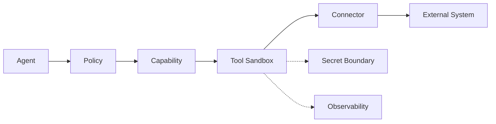

# CAT Tool Registry

**Status:** L2 — Architecture specified

## 1. Definition

A **tool** is an executable mechanism exposed to a capability. It may perform computation, access a data source, call an API, manipulate a file, invoke a model, or interact with an external system.

```text
Capability = what CAT is allowed to accomplish
Tool       = how an implementation can perform part of it
```

A tool MUST NOT become the semantic source of truth for business policy.

## 2. Tool contract

Each tool MUST define:

| Field | Description |
|---|---|
| Tool ID | Stable identifier |
| Version | Tool contract version |
| Capability binding | Capabilities permitted to use it |
| Input schema | Strict typed schema |
| Output schema | Strict typed schema |
| Side effects | S0–S3 |
| Trust level | Required trust boundary |
| Credentials | Secret references, never raw secrets |
| Network policy | Allowed egress/destinations |
| Rate limits | Requests/concurrency/quotas |
| Timeout | Hard execution limit |
| Idempotency | Key and duplicate behavior |
| Retry policy | Typed retry rules |
| Audit policy | Required records |
| Health check | Availability semantics |
| Cost | Monetary/resource accounting |

## 3. Tool taxonomy

```text
COMPUTE
├── deterministic calculators
├── parsers
├── classifiers
└── transformation engines

AI
├── text models
├── embedding models
├── image/audio/video models
└── evaluation models

DATA
├── database access
├── search
├── object storage
├── knowledge graph
└── vector retrieval

EXTERNAL
├── affiliate networks
├── advertising platforms
├── publishing channels
├── analytics providers
└── notification systems

PLATFORM
├── scheduler
├── queue
├── browser/runtime
├── filesystem
└── observability
```

## 4. Execution rules

1. Validate input before execution.
2. Resolve policy before side effects.
3. Resolve credentials from a secret boundary.
4. Enforce timeout and resource limits.
5. Record invocation identity and idempotency key.
6. Normalize provider-specific errors into CAT error classes.
7. Never return provider credentials or hidden internal secrets.
8. Emit sufficient telemetry to reconstruct execution.

## 5. Side-effect classes

| Class | Meaning | Typical examples |
|---|---|---|
| S0 | Pure/read-only | parsing, retrieval |
| S1 | Reversible internal mutation | cache/config draft |
| S2 | External reversible action | publishing update, campaign draft |
| S3 | Material external/economic action | spend, financial action, irreversible publish |

S2/S3 tools require stronger authorization and audit controls.

## 6. Tool isolation



A tool never receives broad credentials merely because its caller is trusted.

## 7. Failure contract

Tools classify outcomes as:

- `SUCCESS`
- `RETRYABLE_FAILURE`
- `RATE_LIMITED`
- `TIMEOUT`
- `AUTHORIZATION_FAILURE`
- `VALIDATION_FAILURE`
- `PROVIDER_FAILURE`
- `EXTERNAL_UNKNOWN`
- `POLICY_BLOCKED`
- `CANCELLED`

`EXTERNAL_UNKNOWN` is distinct from a confirmed failure and must not trigger unsafe duplicate side effects.

## 8. Registry governance

Tool additions require capability binding, security review appropriate to side-effect level, contract tests, observability coverage, and provider/license/compliance review where applicable.
