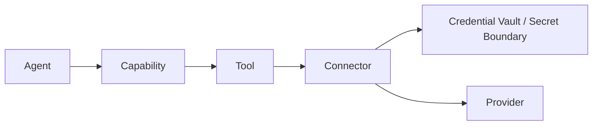

# CAT Connector Registry

**Status:** L2 — Architecture specified

## 1. Purpose

A **connector** is CAT's integration boundary for an external service or infrastructure system. It translates between a provider's protocol and CAT's stable internal contracts.

```text
CAT Contract → Connector → Provider API/Protocol
```

Connectors prevent provider-specific schemas and failure semantics from leaking into agents or domain logic.

## 2. Connector responsibilities

- authentication and credential reference resolution
- request/response translation
- provider error normalization
- rate-limit handling
- timeout and retry enforcement
- pagination and batching
- webhook/event normalization
- idempotency support
- provider health reporting
- compliance metadata
- telemetry and audit emission

## 3. Connector contract

```yaml
connector:
  id: cat.connector.<domain>.<provider>.<service>.v1
  provider: <provider-id>
  protocols: [https]
  capabilities: []
  credentials: []
  side_effect_class: S0
  timeout_ms: 10000
  retry_policy: bounded
  idempotency: required
  healthcheck: required
  audit: required
```

## 4. Credential boundary



Agents never receive reusable provider secrets unless an explicitly approved architecture requires it. Prefer short-lived scoped credentials and provider-side permissions.

## 5. Health model

Connector health includes:

- reachability
- authentication validity
- latency
- error rate
- rate-limit pressure
- quota availability
- provider incident state
- contract compatibility
- data freshness where relevant

Health is evidence, not a permanent property. The provider registry may downgrade or quarantine an unhealthy connector.

## 6. Integration states

`DISCOVERED → VALIDATED → ACTIVE → DEGRADED → QUARANTINED → RETIRED`

A connector can be degraded without being removed from historical records.

## 7. Provider independence invariant

Domain services MUST depend on CAT contracts/SPI, not concrete provider SDKs. Provider SDKs belong behind connectors/adapters.

```text
GOOD:
AffiliateCapability → AffiliateNetworkSPI → Connector → Provider

BAD:
AffiliateAgent → ProviderSDK → Provider
```

## 8. Connector test suite

Every connector should provide:

1. schema/contract tests
2. authentication tests without exposing secrets
3. timeout/retry tests
4. idempotency tests
5. provider error mapping tests
6. rate-limit behavior tests
7. malformed-response tests
8. webhook/event verification tests when applicable
9. sandbox/integration tests
10. observability assertions

## 9. AI implementation rule

An AI agent adding an integration must first locate the target capability, connector contract, provider record, credential policy, and existing adapter patterns. It must not place provider calls directly inside agents or domain entities.
