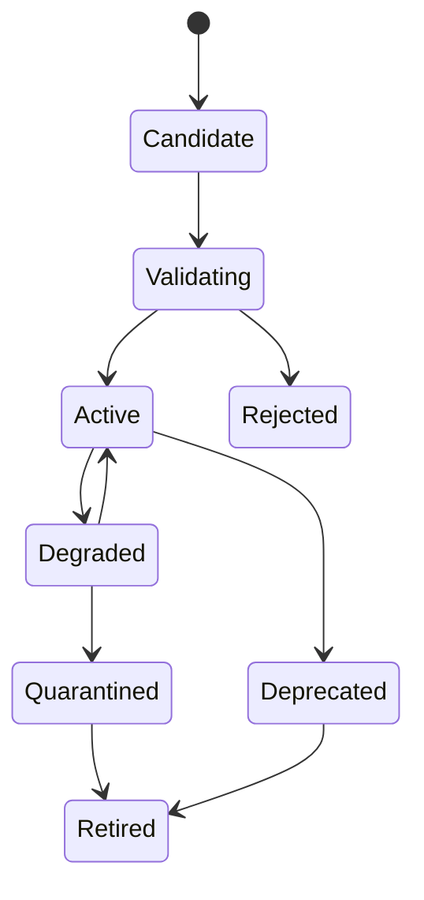

# CAT Provider Registry

**Status:** L2 — Architecture specified

## 1. Purpose

The Provider Registry is the canonical catalog of external vendors and service implementations available to CAT. It allows CAT to select, compare, degrade, replace, and retire providers without changing business semantics.

## 2. Provider record

```yaml
provider:
  id: cat.provider.<domain>.<name>
  status: active
  capabilities: []
  connectors: []
  regions: []
  pricing: {}
  limits: {}
  reliability: {}
  compliance: {}
  data_policy: {}
  dependencies: []
```

## 3. Selection dimensions

Provider selection may consider:

| Dimension | Meaning |
|---|---|
| Contract compatibility | Can the provider satisfy the required capability contract? |
| Reliability | Historical availability/error evidence |
| Latency | Observed performance for the workload |
| Economics | Expected monetary and compute cost |
| Capacity | Quota and concurrency headroom |
| Geography | Region/market availability |
| Compliance | Applicable policy and jurisdiction constraints |
| Quality | Evaluation results for the required task |
| Resilience | Diversity and failover suitability |
| Data policy | Retention, training and processing constraints |

No single dimension is universally dominant; selection is policy-controlled and workload-specific.

## 4. Provider lifecycle



## 5. Health and evidence

Provider health is derived from observed evidence rather than a static label. At minimum CAT should track availability, latency, error classes, quota pressure, contract failures, and recent incidents.

## 6. Selection invariant

```text
Business intent
    ↓
CAT capability contract
    ↓
Eligible provider set
    ↓
Policy + quality + economics + reliability evaluation
    ↓
Selected provider
    ↓
Connector execution
```

An agent must not select a provider merely because its SDK is installed.

## 7. Multi-provider strategy

Where economically and operationally justified, CAT should maintain multiple viable providers for critical capabilities. Provider diversity reduces lock-in and creates controlled failover paths.

However, multi-provider support is not an excuse to duplicate business logic. All providers implement the same CAT-level contract.

## 8. Commercial governance

Provider records should capture contract dates, pricing assumptions, quotas, billing units, data-processing terms, compliance constraints, and ownership. Economic decisions use current observed data when available and label estimates separately from realized costs.
