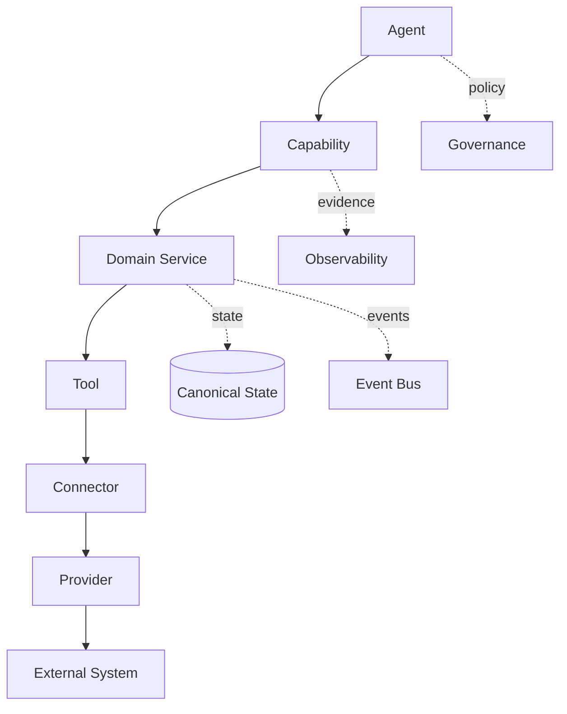

# CAT Capability Dependency Matrix

**Status:** L2 — Architecture specified

## 1. Canonical dependency graph



## 2. Dependency rules

| From | May depend on | Must not depend directly on |
|---|---|---|
| Agent | capabilities, context, policy | provider SDKs, secrets |
| Capability | domain services, policy, contracts | vendor-specific semantics |
| Domain service | repositories, SPI, internal tools | agent implementation |
| Tool | connector, bounded runtime | unrestricted external systems |
| Connector | provider protocol, secret boundary | agent state |
| Provider | external service | CAT business semantics |

## 3. Risk propagation

The effective execution risk is determined by the most restrictive relevant boundary, not by the agent's nominal trust level.

```text
Agent autonomy
      ×
Capability risk
      ×
Side-effect class
      ×
Data sensitivity
      ×
Provider trust
      ×
Economic exposure
      ↓
Required authorization
```

## 4. Dependency record

Each dependency should be represented explicitly:

```yaml
dependency:
  source: cat.agent.affiliate.scout.v1
  target: cat.capability.affiliate.discover.v1
  relation: invokes
  required: true
  failure_policy: degrade
  owner: affiliate-domain
```

## 5. Blast-radius analysis

Before changing a capability, identify:

1. dependent agents
2. dependent workflows
3. dependent tools/connectors
4. events and projections
5. persisted data contracts
6. dashboards/KPIs
7. policies and approvals
8. external integrations

Breaking changes require an explicit migration plan.

## 6. Dependency direction invariant

Business semantics flow inward toward stable CAT contracts. Provider-specific concerns flow outward toward adapters.

```text
Stable semantic core  ←────────────────→  volatile integrations
Agent → Capability → Domain → SPI → Adapter → Provider
```

This direction is a core anti-lock-in invariant.

## 7. AI code-change protocol

An AI coding agent must perform dependency-impact analysis before changing a registry entry or contract. The change is incomplete until affected tests, contracts, documentation, and migration requirements have been evaluated.
