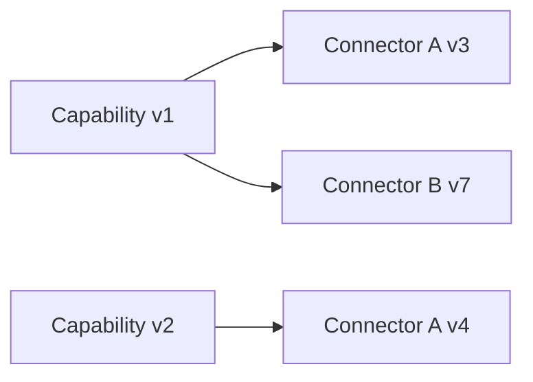

# CAT Capability Lifecycle and Versioning

**Status:** L2 — Architecture specified

## 1. Lifecycle

```text
PROPOSED
  ↓
SPECIFIED
  ↓
VALIDATED
  ↓
ACTIVE
  ↓
DEPRECATED
  ↓
RETIRED
```

Each transition must have an owner, evidence, and audit record.

## 2. Semantic versioning

Capability contracts use `MAJOR.MINOR.PATCH` semantics:

- **MAJOR:** incompatible contract change.
- **MINOR:** backward-compatible functionality.
- **PATCH:** backward-compatible clarification or defect correction.

A breaking major version gets a new stable capability ID/version namespace.

## 3. Compatibility

Providers may evolve independently from CAT capability contracts. Connector versions absorb provider changes where possible.



A provider version change does not automatically require a capability version change.

## 4. Deprecation policy

Before deprecation:

1. identify consumers;
2. publish migration guidance;
3. support the compatibility window where feasible;
4. observe remaining usage;
5. remove only after policy-approved retirement.

Historical events and audit records must remain interpretable after retirement.

## 5. Contract testing

Every active capability should have:

- schema tests
- invariant tests
- authorization tests
- idempotency tests
- failure classification tests
- compatibility tests
- observability assertions
- integration tests for supported implementations

## 6. Change-control invariant

No AI agent may silently widen a capability's authority while changing its implementation. Any expansion of inputs, outputs, side effects, data scope, or economic authority is a contract change and requires explicit review.
