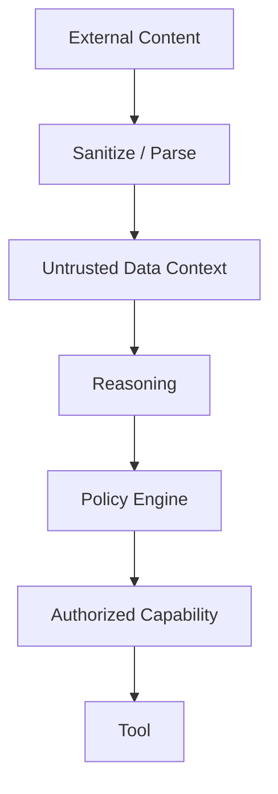

# CAT Tool Security and Execution Boundary

**Status:** L2 — Architecture specified

## 1. Security principle

Tools are controlled execution boundaries, not trusted extensions of an agent.

```text
Untrusted input
    ↓
Agent context
    ↓
Policy decision
    ↓
Capability authorization
    ↓
Sandboxed tool
    ↓
Connector
    ↓
External system
```

## 2. Required controls

- least-privilege capability grants
- strict input validation
- output validation
- secret isolation
- network egress allowlists where feasible
- SSRF protections for URL-capable tools
- timeout and memory/CPU limits
- rate and concurrency limits
- filesystem isolation
- audit logging
- deterministic idempotency keys for durable side effects
- prompt-injection-aware handling of external content

## 3. Prompt injection boundary

External content is **data**, not authority. Instructions found in web pages, documents, emails, APIs, advertisements, affiliate feeds, or tool output must not override CAT policy or system contracts.



## 4. Credential model

Credentials are referenced by opaque secret IDs. Agents and ordinary tool outputs should not receive reusable secrets. Connector execution resolves secrets at the narrowest practical boundary.

## 5. Network security

Network-capable tools should enforce:

1. destination validation;
2. scheme restrictions;
3. DNS/IP rebinding defenses;
4. private-network blocking unless explicitly authorized;
5. redirect validation;
6. response-size limits;
7. content-type validation;
8. timeout limits.

## 6. Economic security

For actions that can spend money, create contractual obligations, publish material content, or alter revenue-critical systems, authorization must include economic scope, budget, actor identity, and an auditable decision.

## 7. Quarantine

A tool/connector may be quarantined when security evidence, repeated contract violations, credential compromise, abnormal cost, or provider instability crosses a policy threshold. Quarantine blocks new execution while preserving evidence needed for investigation.

## 8. Security events

Important events include:

`TOOL_AUTH_DENIED`, `SECRET_ACCESS`, `EGRESS_BLOCKED`, `PROMPT_INJECTION_DETECTED`, `POLICY_VIOLATION`, `TOOL_QUARANTINED`, `UNUSUAL_COST`, `EXTERNAL_UNKNOWN`.

Security telemetry must be correlated with agent, capability, workflow, invocation, and execution-attempt IDs where available.
