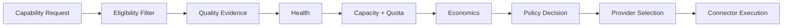
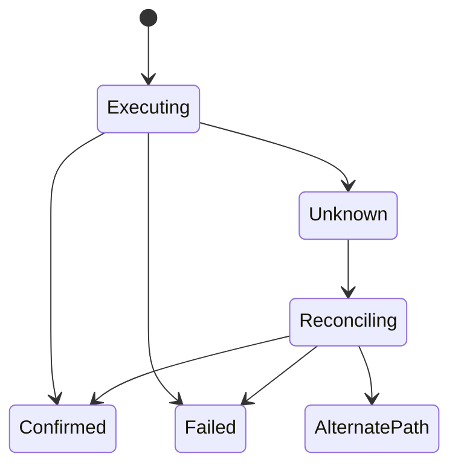

# CAT Provider Selection and Failover

**Status:** L2 — Architecture specified

## 1. Objective

Provider selection must optimize the currently authorized workload while preserving contract compatibility, reliability, economic control, and provider independence.

## 2. Selection pipeline

## 3. Eligibility filter

A provider is eligible only when:

- it implements the required contract;
- region/compliance requirements are satisfied;
- required quota is available;
- credentials are valid;
- data-processing constraints are compatible;
- security policy permits the destination;
- the provider is not quarantined.

## 4. Failover classes

| Class | Behavior |
|---|---|
| Retry | Repeat the same provider only when the operation is safely retryable |
| Alternate provider | Select another compatible provider |
| Degrade | Use a lower-capability but safe path |
| Pause | Wait for capacity/approval/health recovery |
| Escalate | Require human or governance intervention |

Failover must never blindly duplicate an uncertain external side effect.

## 5. External-unknown handling

For side-effecting requests, a timeout does not prove that the external action failed. CAT should reconcile status through provider APIs/webhooks before issuing a potentially duplicating action.

## 6. Anti-lock-in invariant

Business logic must not contain provider-specific branching such as `if provider == X` for ordinary capability semantics. Provider-specific behavior belongs in adapters, policy/configuration, or explicitly versioned connector contracts.

## 7. Selection evidence

Every material provider selection should record enough context to explain:

- required capability/version;
- eligible providers;
- policy constraints;
- observed health;
- expected cost;
- selected provider;
- fallback path if used;
- actual result and cost.

## 8. Continuous optimization

Selection quality should be evaluated against realized outcomes. Historical evidence can influence future routing, but it must not silently override hard policy constraints or current provider eligibility.
