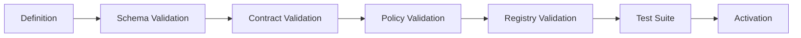

# CAT Canonical Schema System

**Status:** L2 — Architecture specified  
**Purpose:** Establish the machine-readable contract layer for Agents, Capabilities, Tools, Connectors and Providers.

## 1. Principle

CAT needs one canonical semantic model that can be consumed by humans, AI agents, validators, registries and runtime services.

```text
Bible
  ↓ defines meaning
Canonical Schemas
  ↓ define structure
Contracts
  ↓ enforce behavior
Registry
  ↓ indexes instances
Runtime
  ↓ executes authorized instances
Evidence
  ↓ records reality
```

A schema describes structure. A contract describes required behavior. A registry describes known instances. Runtime state describes what is happening now.

## 2. Canonical schema families

```text
cat.schema.agent.v1
cat.schema.capability.v1
cat.schema.tool.v1
cat.schema.connector.v1
cat.schema.provider.v1
cat.schema.workflow.v1
cat.schema.policy.v1
cat.schema.event.v1
cat.schema.invocation.v1
cat.schema.outcome.v1
cat.schema.evidence.v1
```

Schemas are provider-neutral and implementation-neutral.

## 3. Common metadata envelope

Every canonical object SHOULD expose:

```yaml
id: stable identifier
kind: canonical type
version: schema version
status: lifecycle status
name: human-readable name
description: semantic description
owner: owning domain/team
created_at: timestamp
updated_at: timestamp
provenance:
  source: source-of-definition
  author: actor
  revision: revision identifier
```

Runtime objects additionally require correlation and execution metadata appropriate to their class.

## 4. Agent schema

```yaml
kind: agent
id: cat.agent.<domain>.<name>.v1
version: 1.0.0
status: active
identity:
  role: specialist
  mission: "..."
capabilities: []
policy:
  autonomy_level: A1
  policy_profile: "..."
context:
  knowledge_scopes: []
  memory_scopes: []
execution:
  concurrency_limit: 1
  timeout_ms: 30000
  retry_policy: bounded
economics:
  budget_profile: "..."
evaluation:
  metrics: []
```

## 5. Capability schema

```yaml
kind: capability
id: cat.capability.<domain>.<name>.v1
version: 1.0.0
status: active
purpose: "..."
input_schema: "..."
output_schema: "..."
side_effect_class: S0
required_policy: "..."
idempotency: required
evidence: required
implementations: []
```

## 6. Tool schema

```yaml
kind: tool
id: cat.tool.<domain>.<name>.v1
version: 1.0.0
capability_bindings: []
input_schema: "..."
output_schema: "..."
side_effect_class: S0
network_policy: {}
credential_refs: []
limits:
  timeout_ms: 10000
  concurrency: 4
retry_policy: bounded
```

## 7. Connector schema

```yaml
kind: connector
id: cat.connector.<domain>.<provider>.<service>.v1
provider_id: cat.provider.example
protocols: [https]
capability_bindings: []
credential_profile: "secret-ref"
healthcheck: required
error_mapping: "..."
```

## 8. Provider schema

```yaml
kind: provider
id: cat.provider.<domain>.<name>
status: active
capabilities: []
connectors: []
regions: []
pricing: {}
limits: {}
reliability: {}
compliance: {}
data_policy: {}
```

## 9. Invocation schema

The invocation object is the runtime authorization and correlation boundary:

```yaml
invocation_id: uuid
agent_id: cat.agent.example.v1
capability_id: cat.capability.example.v1
requested_at: timestamp
correlation_id: uuid
idempotency_key: string
policy_context: {}
input: {}
budget_context: {}
```

Secrets MUST NOT be serialized into this envelope.

## 10. Outcome schema

```yaml
invocation_id: uuid
status: SUCCESS | RETRYABLE_FAILURE | UNKNOWN | DENIED | CANCELLED
output: {}
evidence_refs: []
provider_ref: optional
usage:
  model_tokens: 0
  compute_ms: 0
  monetary_cost: 0
errors: []
completed_at: timestamp
```

`UNKNOWN` means the external state is not yet conclusively known.

## 11. Schema invariants

1. IDs are globally unique within CAT.
2. Versions are explicit.
3. Unknown fields are handled according to compatibility policy.
4. Required fields cannot be omitted silently.
5. Sensitive values are represented by references, not plaintext.
6. Side effects are explicitly classified.
7. Runtime outcomes are distinguishable from desired outcomes.
8. Provenance is retained for material decisions and evidence.
9. Schema changes require compatibility analysis.
10. Examples are never treated as authorization.

## 12. Validation pipeline



## 13. Serialization strategy

YAML is preferred for human-authored registry specifications; JSON is preferred for interchange and API payloads; Rust types are generated or maintained as executable contract representations. The exact generation mechanism is an implementation decision and must preserve one semantic source of truth.

## 14. Evolution rule

Never change a schema merely to satisfy one provider. Adapt the provider through its connector unless the semantic requirement genuinely belongs in the CAT contract.
