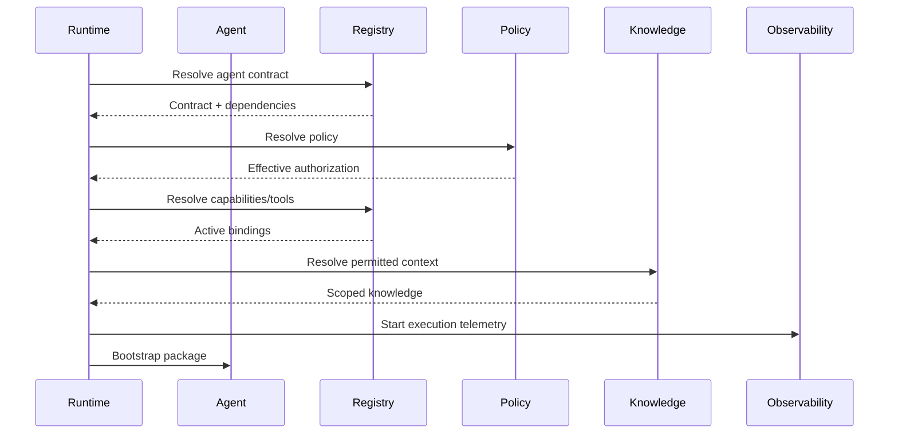

# CAT Agent Bootstrap and Discovery Protocol

**Status:** L2 — Architecture specified  
**Purpose:** Define how a new CAT AI agent acquires trustworthy system context before acting.

## 1. Bootstrap principle

An agent must discover its authority from canonical contracts, not from assumptions encoded in a prompt.

```text
BOOT
 ↓
IDENTITY
 ↓
SYSTEM CONTEXT
 ↓
CAPABILITY DISCOVERY
 ↓
POLICY DISCOVERY
 ↓
KNOWLEDGE/MEMORY SCOPES
 ↓
HEALTH + BUDGET
 ↓
READINESS
 ↓
AUTHORIZED EXECUTION
```

## 2. Bootstrap package

The runtime should provide the agent with:

- immutable agent identity;
- mission and non-goals;
- active capability IDs and versions;
- policy profile and autonomy boundary;
- permitted knowledge/memory scopes;
- tool bindings;
- economic/resource budget;
- execution limits;
- observability requirements;
- escalation routes;
- current system health relevant to its mission.

## 3. Discovery order



## 4. Readiness gates

An agent is not `READY` when merely instantiated. It must pass:

1. contract validation;
2. dependency resolution;
3. policy resolution;
4. capability authorization validation;
5. budget validation;
6. required health checks;
7. model/provider compatibility checks;
8. security checks;
9. observability initialization.

## 5. Context minimization

Bootstrap context should contain only information required for the agent's authorized mission. Large unrestricted context increases cost, attack surface, ambiguity and accidental authority.

## 6. Runtime discovery vs static specification

Static specifications define intended authority. Runtime discovery determines what is currently enabled, healthy and available.

```text
SPECIFICATION ≠ RUNTIME AVAILABILITY
```

A capability can be specified and active in the registry while temporarily unavailable due to health, quota, policy or provider conditions.

## 7. Failure behavior

If a required dependency cannot be resolved, the agent enters a non-running state rather than improvising an alternative authority. Optional dependencies may produce a degraded mode only when the agent contract explicitly permits it.

## 8. AI-agent rule

When a coding agent changes bootstrap behavior, it must preserve the principle that **identity, authorization, capability and budget are independently resolved and auditable**.
