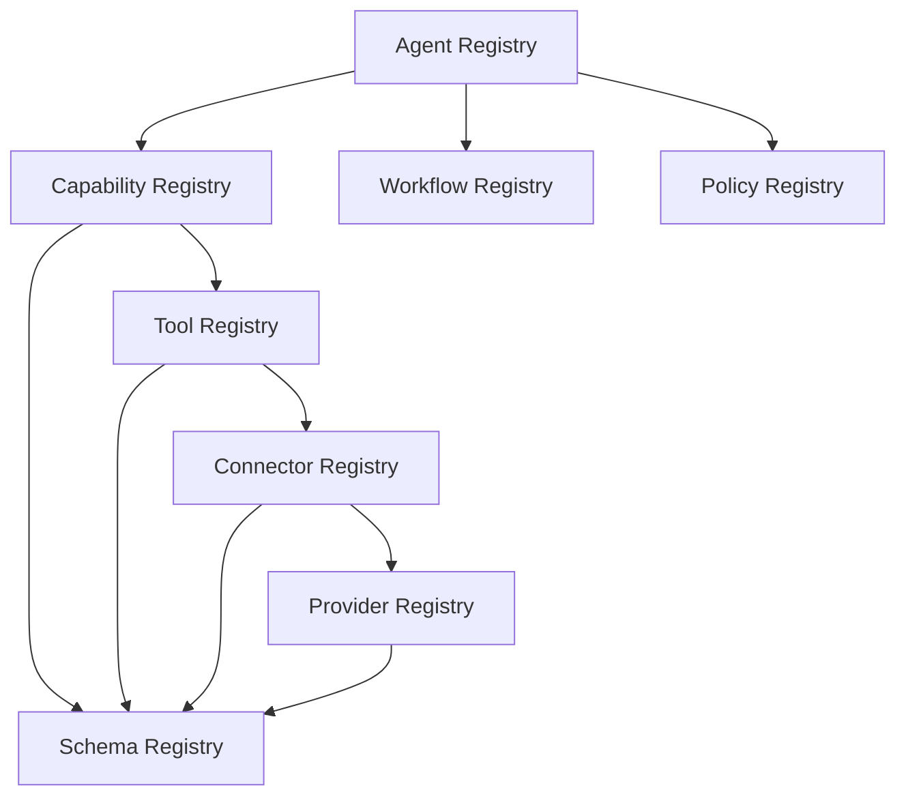

# CAT Registry Operating Model

**Status:** L2 — Architecture specified

## 1. Registries are control-plane infrastructure

CAT registries are not passive documentation. They become the control-plane catalog used to discover, validate, authorize and operate system components.

```text
Registry
 ├── Identity
 ├── Contract
 ├── Lifecycle
 ├── Dependencies
 ├── Security
 ├── Economics
 ├── Health
 └── Provenance
```

## 2. Registry family

```text
Agent Registry
Capability Registry
Tool Registry
Connector Registry
Provider Registry
Schema Registry
Workflow Registry
Policy Registry
```

These registries form a connected graph rather than independent lists.

## 3. Graph invariant



A registry reference must point to a stable versioned identity.

## 4. Operational operations

Registries support:

- discover
- validate
- activate
- disable
- quarantine
- deprecate
- retire
- inspect dependencies
- inspect health
- inspect ownership
- inspect cost
- audit changes

## 5. Change governance

Material changes require provenance and should record:

```text
who changed it
what changed
why it changed
previous version
new version
affected dependents
security impact
economic impact
migration requirement
validation evidence
```

## 6. Runtime caching

Registry data may be cached for performance, but caches are not canonical truth. Runtime caches must have bounded staleness and explicit invalidation/refresh behavior.

## 7. Disaster recovery

Registry state is operationally important and must be backed up/recoverable according to the same reliability class as the contracts that depend on it.

## 8. AI-agent rule

AI agents may read registry data freely within their authorized context, but changing a registry entry is a governed control-plane operation and must follow the relevant contract, security and lifecycle rules.
