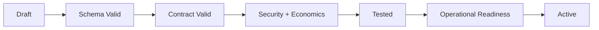

# CAT Contract Quality Gates

**Status:** L2 — Architecture specified

## 1. Purpose

Every new or modified canonical contract passes explicit quality gates before it can become active.

## 2. Gates

| Gate | Question |
|---|---|
| Semantic | Is the responsibility clear and non-duplicative? |
| Structural | Is the schema valid and deterministic? |
| Compatibility | Can existing consumers continue safely? |
| Security | Are authority, data and secrets bounded? |
| Reliability | Are timeout, retry, idempotency and unknown outcomes defined? |
| Economics | Can resource and monetary cost be bounded and attributed? |
| Observability | Can execution be reconstructed from evidence? |
| Evaluation | Is success measurable? |
| Ownership | Is a responsible domain/owner defined? |
| Migration | Is upgrade/rollback behavior explicit? |

## 3. Activation rule

Failure at any mandatory gate prevents activation.

## 4. AI-generated contract safeguard

AI-generated schemas require the same gates as human-authored schemas. Fluency, completeness of prose, or a successful code generation step is not evidence that a contract is semantically correct.

## 5. Definition of done

A contract is considered `ACTIVE` only when its schema, ownership, lifecycle, security boundary, compatibility expectations, tests and operational requirements are all recorded and validated.
