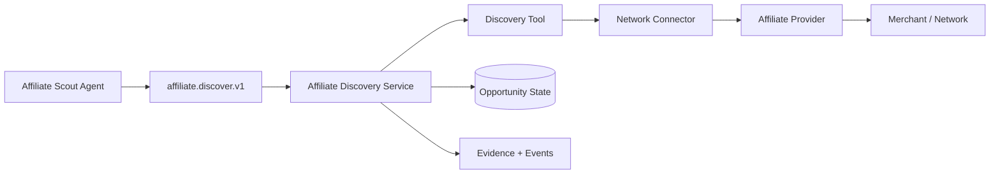

# CAT Contract Example — Affiliate Discovery

**Status:** L3 — Contract example / target integration

## 1. Purpose

This chapter demonstrates how the canonical Agent → Capability → Tool → Connector → Provider model applies to a real CAT business capability without binding the domain to a specific affiliate network.

## 2. Semantic contract

```text
Capability:
cat.capability.affiliate.discover.v1

Input:
- market
- category
- audience constraints
- freshness requirement
- budget/resource envelope

Output:
- normalized opportunities
- provenance
- confidence
- freshness
- eligibility/compliance signals
- estimated economics
```

## 3. Execution graph



## 4. Provider independence

The discovery service must operate on normalized CAT opportunity contracts. Provider-specific product fields, status codes and API semantics are translated inside connectors.

## 5. Quality gates

A discovered opportunity should not become an actionable opportunity solely because an external feed returned it. CAT may require:

- identity normalization;
- deduplication;
- merchant/network eligibility;
- freshness validation;
- economics validation;
- policy/compliance checks;
- provenance completeness.

## 6. Failure semantics

A provider timeout must not automatically delete existing opportunity state. A stale provider response must be distinguishable from a confirmed disappearance. Unknown external state may trigger reconciliation rather than destructive mutation.

## 7. Evidence

Material opportunity decisions should retain source/provider identity, observation timestamp, normalized attributes, transformation lineage and confidence.

## 8. Economic attribution

Discovery costs should be attributable to the relevant research goal/workflow/agent. Realized affiliate revenue is measured later and must not be confused with estimated commission at discovery time.

## 9. Implementation rule

This example is a contract pattern, not evidence that every described feature is already implemented. Runtime integration must be verified against the current repository before being marked operational.
