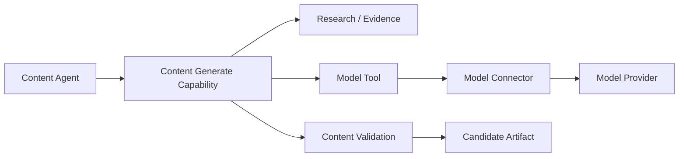

# CAT Contract Example — Content Generation

**Status:** L3 — Contract example / target integration

## 1. Semantic contract

```text
cat.capability.content.generate.v1
```

The capability transforms an approved content brief and authorized evidence into a candidate content artifact. It does not itself decide whether the artifact may be published.

## 2. Boundary



## 3. Separation of concerns

```text
Research     = gather evidence
Generation   = create candidate
Validation   = assess candidate
Decision     = determine whether action is permitted
Publishing   = perform external side effect
Measurement  = observe outcome
```

These are separate capabilities even when one agent coordinates them.

## 4. Required output metadata

A generated artifact should retain, where applicable:

- source brief ID;
- evidence references;
- model/provider references;
- generation timestamp;
- content version;
- policy profile;
- evaluation results;
- estimated resource cost.

## 5. Safety boundary

Model output is untrusted generated data until it passes the applicable validation and policy gates. A model cannot authorize its own output.

## 6. Provider independence

The content capability consumes a model-neutral contract. Switching text/image/multimodal providers must not require changing the content agent's business semantics.

## 7. Publication boundary

Generation is normally non-external (`S0`/internal mutation depending on persistence). Publishing is a separate side-effecting capability with its own authorization, idempotency and audit requirements.

## 8. Implementation note

This document is a canonical contract example and does not assert that all described runtime behavior is already operational in the repository.
