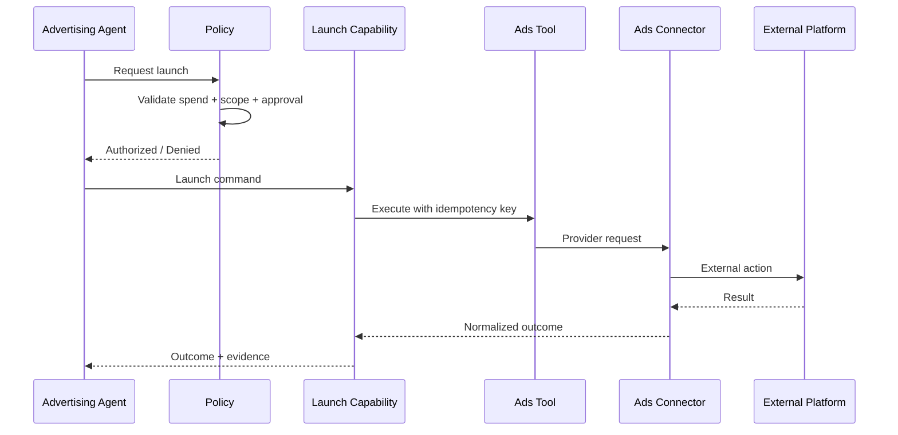

# CAT Contract Example — Advertising Action

**Status:** L3 — Contract example / high-risk target integration

## 1. Purpose

Advertising actions illustrate CAT's strongest authorization boundary because an apparently small tool call can create direct financial exposure.

## 2. Capability separation

```text
advertising.research
advertising.plan
advertising.draft
advertising.approve
advertising.launch
advertising.pause
advertising.optimize
advertising.reconcile
```

Planning or optimization analysis must not implicitly grant launch authority.

## 3. Execution boundary



## 4. Economic authorization

A launch request should include, as applicable:

- campaign/account scope;
- maximum spend;
- currency;
- time window;
- target scope;
- authorization principal;
- policy version;
- idempotency key;
- approval reference where required.

## 5. Unknown external result

If the provider times out after accepting a launch request, CAT must treat the state as `UNKNOWN` until reconciliation determines whether the campaign was created. Blind retry is prohibited when it could create duplicate spend.

## 6. Audit evidence

Material advertising actions should preserve the authorization decision, requested budget, provider, connector, invocation, external identifier, timestamps, resulting state and realized cost when available.

## 7. Implementation rule

This is a target contract pattern. Production activation requires policy, security, reconciliation, financial controls, integration tests and operational evidence.
